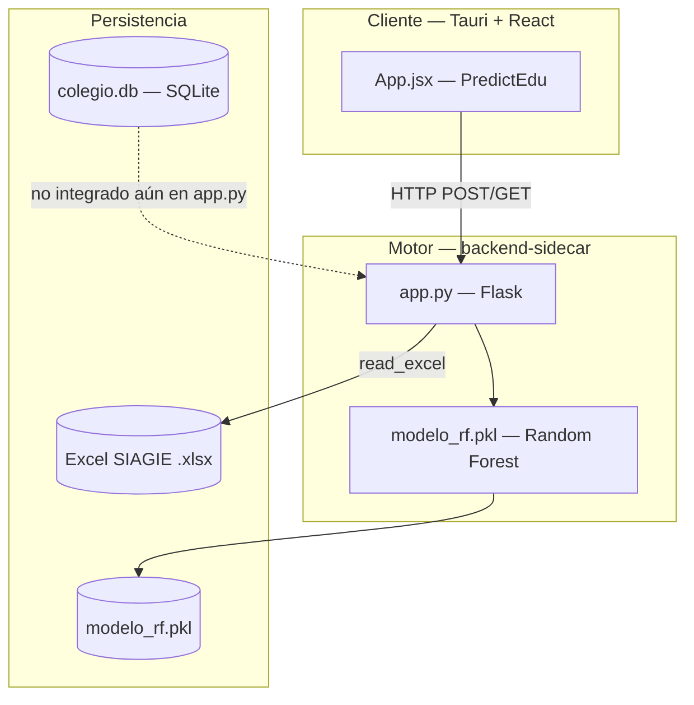
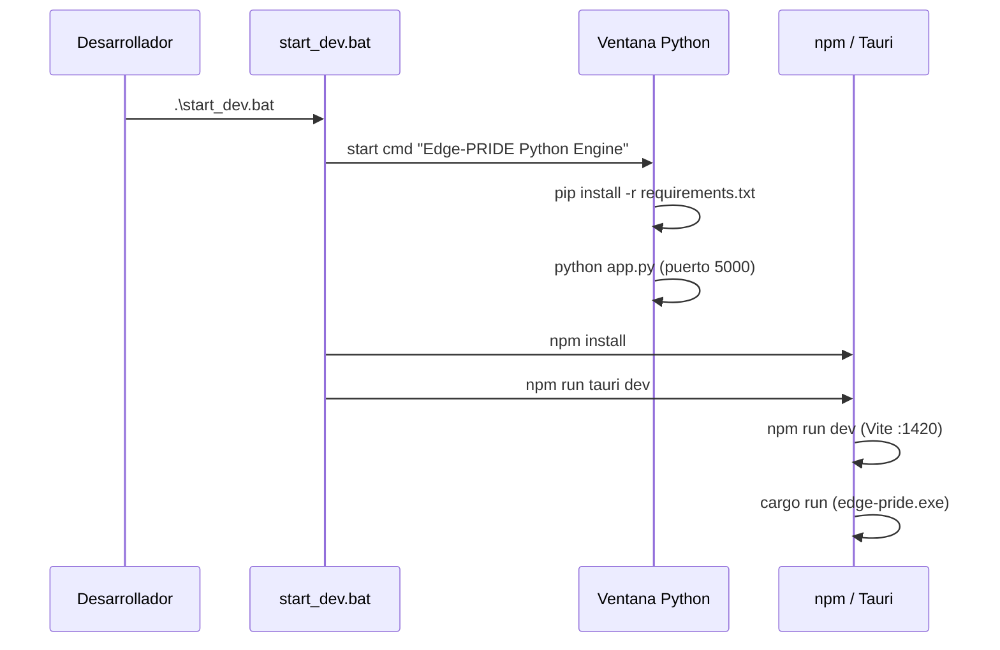
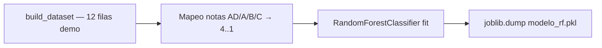
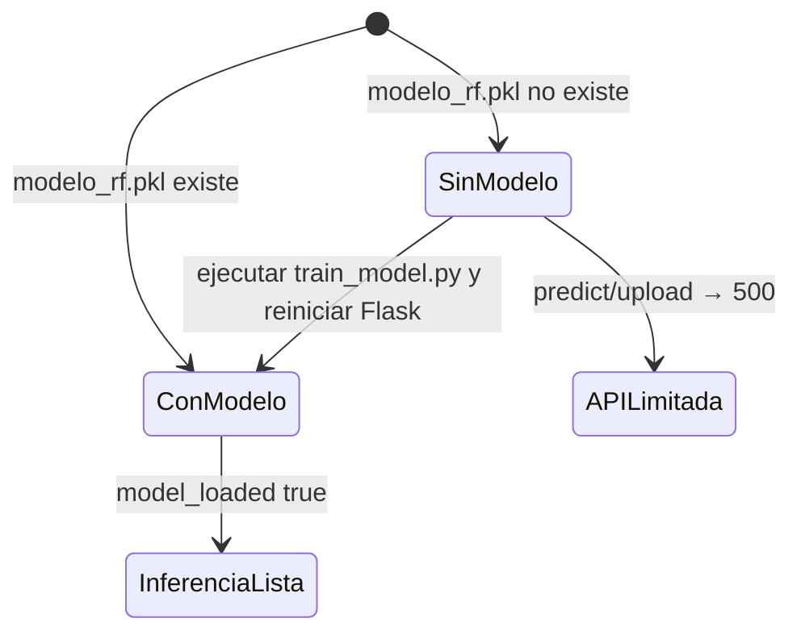
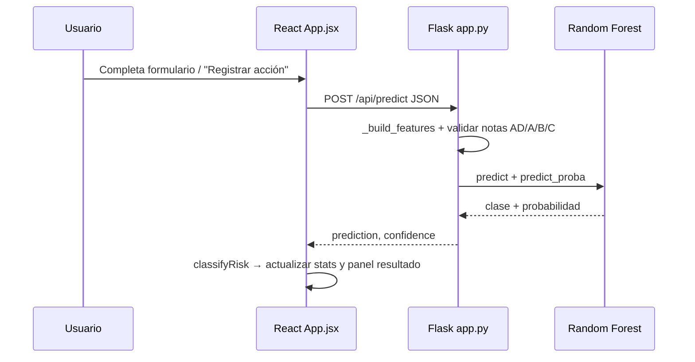
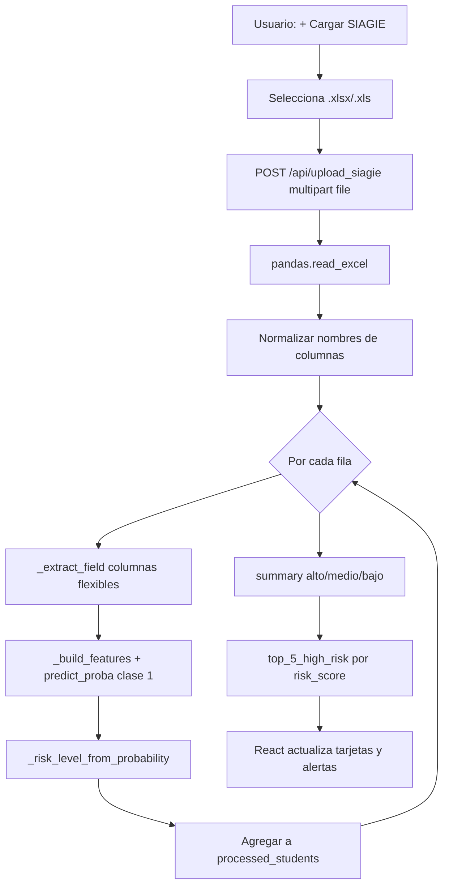
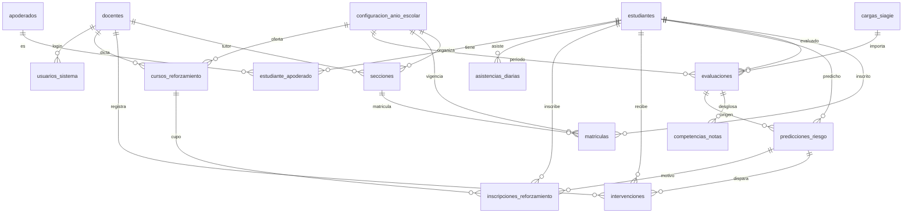
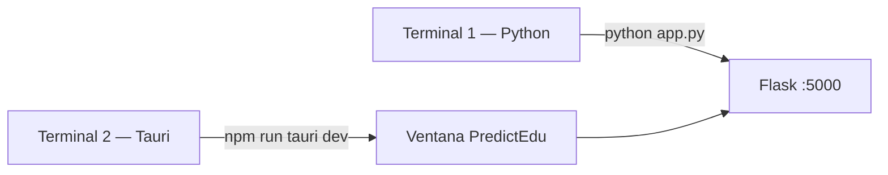
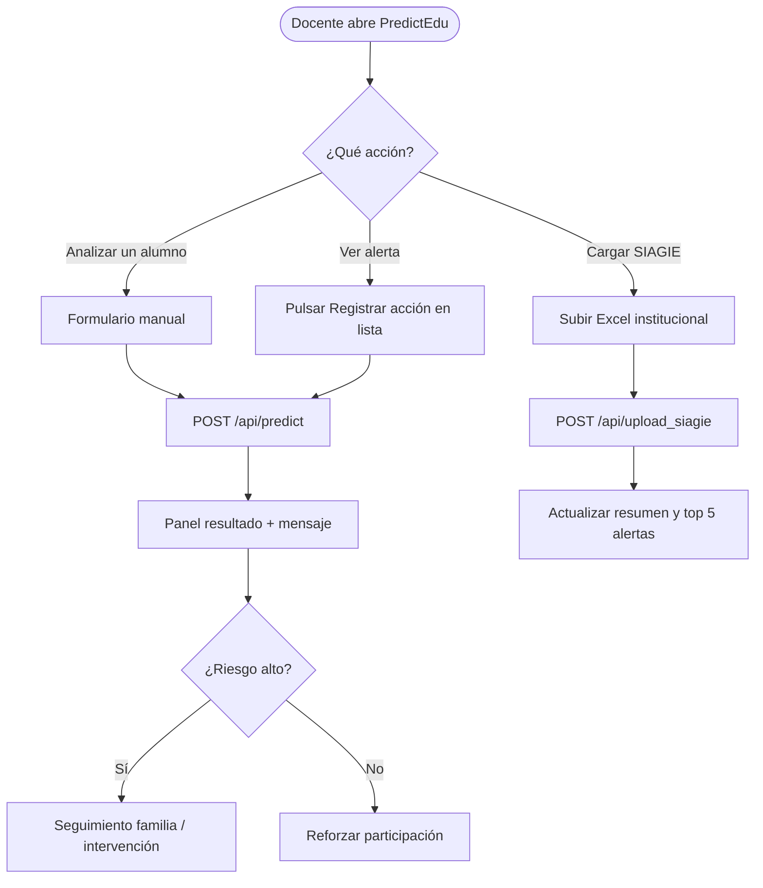

# MAPEO — PredictEdu / Edge-PRIDE

Documento de mapeo de **todos los procesos** del software: arquitectura, flujos de datos, APIs, modelo de IA, base de datos y operación en desarrollo.

**Institución:** I.E.I. N° 32857 — Huacalle  
**Stack:** Tauri 2 + React 19 + Vite | Flask (sidecar) | scikit-learn | SQLite (preparado)

---

## 1. Visión general del sistema

El sistema predice **riesgo de deserción escolar** a partir de indicadores académicos y de asistencia. Opera en dos capas que deben ejecutarse en paralelo:

| Capa | Tecnología | Puerto / salida | Rol |
|------|------------|-----------------|-----|
| **Interfaz (cliente)** | Tauri + React + Vite | Ventana de escritorio + `http://localhost:1420` (dev) | Dashboard, formularios, carga SIAGIE |
| **Motor (servidor local)** | Flask + Random Forest | `http://127.0.0.1:5000` | API REST, inferencia ML, lectura Excel |



> **Nota:** La base de datos SQLite existe y se puede crear con `db_setup.py`, pero **`app.py` no la usa** en las predicciones actuales. Los datos fluyen en memoria (JSON / Excel).

---

## 2. Estructura del repositorio

```
PredictHuacalle-main/
├── src/                          # Frontend React
│   ├── App.jsx                   # UI principal y llamadas al API
│   ├── main.jsx                  # Punto de entrada React
│   └── index.css                 # Estilos (Tailwind)
├── src-tauri/                    # Shell de escritorio Tauri (Rust)
│   ├── src/main.rs, lib.rs
│   └── tauri.conf.json           # Ventana, build, devUrl :1420
├── backend-sidecar/              # Motor Python
│   ├── app.py                    # API Flask + inferencia
│   ├── requirements.txt
│   ├── ml_models/
│   │   ├── train_model.py        # Entrenamiento offline
│   │   └── modelo_rf.pkl         # Modelo serializado (joblib)
│   └── database/
│       ├── db_setup.py           # Creación tabla estudiantes
│       └── colegio.db            # SQLite (archivo)
├── start_dev.bat                 # Arranque desarrollo (Python + Tauri)
├── package.json                  # Scripts npm / dependencias frontend
├── tests/                        # Pruebas y documentación de QA
└── documentacion/                # Material académico / estado del arte
```

---

## 3. Procesos del sistema (índice)

| ID | Proceso | Disparador | Componente principal |
|----|---------|------------|----------------------|
| P01 | Arranque en desarrollo | `.\start_dev.bat` | `start_dev.bat` |
| P02 | Arranque manual del motor | `python backend-sidecar/app.py` | Flask |
| P03 | Arranque manual de la UI | `npm run tauri dev` | Tauri + Vite |
| P04 | Entrenamiento del modelo ML | `python ml_models/train_model.py` | scikit-learn |
| P05 | Carga del modelo al iniciar Flask | Automático al importar `app.py` | joblib |
| P06 | Verificación de salud del motor | `GET /api/status` | Flask |
| P07 | Predicción individual | Formulario o alerta en UI → `POST /api/predict` | Flask + RF |
| P08 | Carga masiva SIAGIE (Excel) | Botón UI → `POST /api/upload_siagie` | pandas + Flask + RF |
| P09 | Creación de base de datos | `python database/db_setup.py` | SQLite |
| P10 | Clasificación de riesgo en UI (post-respuesta) | Tras respuesta API en React | `App.jsx` |

---

## 4. P01 — Arranque en desarrollo (`start_dev.bat`)



**Pasos internos:**

1. Abre una ventana CMD separada en `backend-sidecar`, instala dependencias Python y ejecuta `app.py`.
2. En la terminal actual: `npm install` y `npm run tauri dev`.
3. Tauri ejecuta `beforeDevCommand`: `npm run dev` → Vite en `http://localhost:1420`.
4. Tauri compila y lanza `edge-pride.exe`, que embebe la UI React.

**Requisitos previos:** Node.js, Python 3.10+, Rust (rustup), Visual Studio Build Tools (C++), WebView2.

---

## 5. P04 — Entrenamiento del modelo (offline)

**Archivo:** `backend-sidecar/ml_models/train_model.py`  
**Salida:** `backend-sidecar/ml_models/modelo_rf.pkl`



| Paso | Descripción |
|------|-------------|
| 1 | Construye un `DataFrame` con datos de ejemplo (asistencias, notas literales, participación, etiqueta `riesgo_desercion` 0/1). |
| 2 | Convierte `nota_matematica` y `nota_lenguaje` con `GRADE_TO_SCORE`: C=1, B=2, A=3, AD=4. |
| 3 | Entrena `RandomForestClassifier(n_estimators=100, random_state=42)`. |
| 4 | Guarda el modelo con `joblib` en `modelo_rf.pkl`. |

**Comando:**

```powershell
python .\backend-sidecar\ml_models\train_model.py
```

Sin este archivo, Flask arranca pero `model_loaded` será `false` y `/api/predict` devuelve error 500.

---

## 6. P05 — Carga del modelo al iniciar Flask

**Archivo:** `backend-sidecar/app.py`

Al importar el módulo:

1. Define `MODEL_PATH` → `ml_models/modelo_rf.pkl`.
2. Ejecuta `_load_model()` → `joblib.load` si el archivo existe; si no, `model = None`.
3. Expone el estado en `GET /api/status` (`model_loaded`).



---

## 7. P06 — Verificación de salud (`GET /api/status`)

| Campo | Significado |
|-------|-------------|
| `status` | `"ok"` si el servidor responde |
| `message` | Mensaje descriptivo del motor |
| `model_loaded` | `true` si `modelo_rf.pkl` cargó correctamente |

**URL:** `http://127.0.0.1:5000/api/status`  
**Método:** GET (válido desde navegador).

La raíz `/` **no tiene ruta** → 404 es normal.

---

## 8. P07 — Predicción individual

### 8.1 Flujo end-to-end



### 8.2 Entrada (JSON)

| Campo | Tipo | Validación |
|-------|------|------------|
| `asistencias` | número | % asistencia |
| `nota_matematica` | string | AD, A, B o C |
| `nota_lenguaje` | string | AD, A, B o C |
| `participacion` | número | escala usada en entrenamiento (ej. 0–10) |

### 8.3 Transformación en el motor (`_build_features`)

1. Normaliza notas a mayúsculas y mapea a escala numérica 1–4.
2. Construye vector: `[asistencias, nota_mat_num, nota_len_num, participacion]`.
3. Si la nota no es válida → HTTP **400**.

### 8.4 Salida (JSON)

| Campo | Descripción |
|-------|-------------|
| `prediction` | `"Alto Riesgo"` (clase 1) o `"Bajo Riesgo"` (clase 0) |
| `confidence` | Probabilidad de la clase predicha |
| `model` | `"Random Forest"` |
| `received` | Eco del payload enviado |

### 8.5 Procesamiento adicional en React (`classifyRisk`)

Tras recibir la respuesta, la UI reclasifica para el dashboard:

| Condición | Bucket en dashboard |
|-----------|---------------------|
| `prediction` contiene "alto" | `alto` (+1 en contador) |
| confianza entre 0.5 y 0.75 y no es alto | `medio` |
| resto | `bajo` |

> El backend devuelve binario Alto/Bajo; los niveles **medio/alto/bajo** del resumen masivo usan umbrales distintos en `upload_siagie`.

---

## 9. P08 — Carga masiva SIAGIE (Excel)

### 9.1 Flujo



### 9.2 Columnas Excel aceptadas (alias)

| Concepto | Nombres de columna reconocidos |
|----------|-------------------------------|
| Nombre | `nombre`, `estudiante`, `alumno`, `nombres_apellidos` |
| Asistencias | `asistencias`, `asistencia`, `porcentaje_asistencia` |
| Matemática | `nota_matematica`, `matematica`, `competencia_matematica` |
| Lenguaje | `nota_lenguaje`, `lenguaje`, `comunicacion` |
| Participación | `participacion`, `participación` |

Filas con datos inválidos se **omiten** (`continue`) sin detener el lote.

### 9.3 Umbrales de riesgo (backend — `_risk_level_from_probability`)

| Probabilidad riesgo alto (clase 1) | Nivel |
|-----------------------------------|-------|
| ≥ 0.70 | `alto` |
| ≥ 0.45 | `medio` |
| < 0.45 | `bajo` |

### 9.4 Respuesta API

```json
{
  "summary": { "alto": 0, "medio": 0, "bajo": 0 },
  "total_students": 0,
  "top_5_high_risk": [ /* hasta 5 estudiantes */ ]
}
```

React reemplaza `stats`, `alertsData` y muestra resultado agregado en el panel "Resultado del motor".

---

## 10. P09 — Base de datos SQLite

**Archivo:** `backend-sidecar/database/db_setup.py`  
**Base de datos:** `backend-sidecar/database/colegio.db`  
**Esquema version:** 2 (primaria + secundaria)

**Comando:**

```powershell
python .\backend-sidecar\database\db_setup.py
```

### 10.1 Tablas del sistema (23)

| Tabla | Propósito |
|-------|-----------|
| `schema_version` | Control de versiones del esquema |
| `configuracion_anio_escolar` | Año lectivo activo (fechas, bimestres) |
| `docentes` | Personal: tutores, docentes, director, psicólogo |
| `usuarios_sistema` | Acceso futuro a la app (roles) |
| `secciones` | Aulas por nivel (`primaria` 1°–6°, `secundaria` 1°–6°), turno, tutor |
| `estudiantes` | Ficha del alumno (nombres, DNI, código SIAGIE, estado) |
| `matriculas` | Estudiante ↔ sección ↔ año escolar |
| `apoderados` | Padres/apoderados y contacto |
| `estudiante_apoderado` | Relación alumno–apoderado (principal o no) |
| `evaluaciones` | Notas y asistencia por bimestre (AD/A/B/C) |
| `competencias_notas` | Otras áreas curriculares por evaluación |
| `asistencias_diarias` | Registro día a día (presente, falta, tardanza) |
| `predicciones_riesgo` | Historial de inferencias del modelo ML |
| `intervenciones` | Acciones docentes (contacto familia, tutoría, UGEL…) |
| `cursos_reforzamiento` | Catálogo de talleres por área y nivel |
| `inscripciones_reforzamiento` | Alumnos inscritos en cursos + resultado |
| `cargas_siagie` | Auditoría de importaciones Excel |
| `alertas_riesgo` | Alertas automáticas generadas por predicción y umbrales |
| `seguimiento_alertas` | Trazabilidad de acciones realizadas sobre cada alerta |
| `sesiones_reforzamiento` | Registro de cada sesión/tema de un curso de reforzamiento |
| `derivaciones_externas` | Casos derivados a UGEL, salud, DEMUNA u otras entidades |
| `incidencias_convivencia` | Incidentes de convivencia escolar y medidas tomadas |
| `indicadores_mensuales` | KPIs por mes/sección para tablero de gestión |

### 10.2 Diagrama entidad-relación



### 10.3 Niveles educativos

| Nivel | Grados en `secciones.grado` |
|-------|----------------------------|
| **Primaria** | 1° a 6° |
| **Secundaria** | 1° a 6° (compatible con estructura nacional) |

### 10.4 Datos semilla incluidos

Al ejecutar `db_setup.py` por primera vez se crean:

- Año escolar activo (año actual)
- 2 docentes de ejemplo
- 4 secciones (5°A y 6°B primaria; 1°A y 2°A secundaria)
- 2 cursos de reforzamiento planificados (matemática primaria, comunicación secundaria)

### 10.5 Migración desde esquema anterior

Si existía la tabla `estudiantes` antigua (con columnas `asistencias`, `nota_matematica`, etc.), el script:

1. Renombra la tabla legacy
2. Crea la nueva ficha de estudiante
3. Mueve las notas a `evaluaciones` (bimestre 1)
4. Elimina la tabla antigua

| Estado actual | Detalle |
|---------------|---------|
| Esquema | Completo para primaria y secundaria |
| Uso en runtime | **Aún no** — `app.py` no persiste en SQLite |
| Próximo paso | Conectar predicciones, SIAGIE e intervenciones al API |

---

## 11. Mapa de la interfaz (React — `App.jsx`)

### 11.1 Secciones de pantalla

| Sección | Función | Proceso relacionado |
|---------|---------|---------------------|
| Header + "Cargar SIAGIE" | Subida Excel | P08 |
| Tarjetas Resumen (alto/medio/bajo) | Contadores de riesgo | P07, P08, estado inicial demo |
| Gráfico barras | Distribución visual | Derivado de `stats` |
| Formulario "Simular análisis" | Predicción manual | P07 |
| Alertas prioritarias | Lista demo o `top_5` del Excel | P07 al pulsar "Registrar acción" |
| Panel "Resultado del motor" | Última predicción + mensaje motivacional | P07, P08 |

### 11.2 Pestañas (UI)

| Pestaña | Estado en código |
|---------|------------------|
| Resumen | Activa (única implementada visualmente) |
| Estudiantes | Placeholder (sin navegación) |
| Intervenciones | Placeholder (sin navegación) |

### 11.3 Estado inicial (datos demo)

Al abrir la app sin backend, se muestran valores por defecto (`initialStats`, `alertStudents`). Las predicciones reales requieren Flask en `127.0.0.1:5000`.

---

## 12. API REST — referencia completa

| Método | Ruta | Uso | Códigos típicos |
|--------|------|-----|-----------------|
| GET | `/api/status` | Salud y modelo cargado | 200 |
| POST | `/api/predict` | Un estudiante (JSON) | 200, 400, 500 |
| POST | `/api/upload_siagie` | Lote Excel (campo `file`) | 200, 400, 500 |
| GET | `/` | — | **404** (sin ruta) |
| GET | `/api/predict` | — | **405** (requiere POST) |

**Base URL:** `http://127.0.0.1:5000`  
**CORS:** habilitado (`flask-cors`) para llamadas desde el WebView de Tauri.

---

## 13. Modelo de datos — variables de negocio

| Variable | Origen | Escala en ML |
|----------|--------|--------------|
| Asistencias | SIAGIE / formulario | Numérico (% ) |
| Nota matemática | Literal peruana | AD=4, A=3, B=2, C=1 |
| Nota lenguaje | Literal peruana | AD=4, A=3, B=2, C=1 |
| Participación | Registro docente | Numérico |
| Riesgo deserción (entrenamiento) | Etiqueta histórica 0/1 | Solo en `train_model.py` |

**Salida del clasificador:** binaria → se traduce a etiquetas humanas y, en lote, a tres niveles con probabilidad.

---

## 14. Dependencias por capa

### Frontend (`package.json`)

- React 19, Vite 7, Tailwind 4, Tauri 2 API/CLI

### Motor Python (`backend-sidecar/requirements.txt`)

- Flask 3, flask-cors, pandas, scikit-learn, joblib, openpyxl

### Escritorio (`src-tauri/Cargo.toml`)

- tauri 2, serde, tauri-plugin-opener

---

## 15. Operación recomendada (dos terminales)



**Terminal 1 — Motor:**

```powershell
cd c:\Users\Luz\Desktop\PredictHuacalle-main
.\venv\Scripts\Activate.ps1
python .\backend-sidecar\app.py
```

**Terminal 2 — Interfaz:**

```powershell
cd c:\Users\Luz\Desktop\PredictHuacalle-main
npm run tauri dev
```

**O todo junto:** `.\start_dev.bat`

---

## 16. Matriz de procesos vs. persistencia

| Proceso | Lee archivo | Escribe archivo | Base de datos |
|---------|-------------|-----------------|---------------|
| P04 Entrenamiento | — | `modelo_rf.pkl` | No |
| P05 Carga modelo | `modelo_rf.pkl` | — | No |
| P07 Predict | — | — | No |
| P08 Upload SIAGIE | Excel usuario | — | No |
| P09 DB setup | — | `colegio.db` | Crea tabla |
| UI estado | — | — | No (solo React state) |

---

## 17. Errores frecuentes y significado

| Síntoma | Causa | Acción |
|---------|-------|--------|
| 404 en `/` | No hay página raíz | Usar `/api/status` |
| 405 en `/api/predict` en navegador | GET no permitido | Usar POST o la app Tauri |
| `model_loaded: false` | Falta `modelo_rf.pkl` | Ejecutar `train_model.py` |
| Error en UI "No se pudo obtener predicción" | Flask apagado | Levantar `app.py` |
| `Connection refused` | Puerto 5000 sin servicio | Terminal Python |
| Compilación Tauri falla | Sin Rust o sin MSVC | Instalar rustup + Build Tools C++ |
| Filas Excel ignoradas | Columnas o notas inválidas | Revisar alias y AD/A/B/C |

---

## 18. Pruebas automatizadas

| Ubicación | Contenido |
|-----------|-----------|
| `tests/test_logic.py` | Pruebas de lógica del backend |
| `tests/ejemplos-curl.md` | Comandos curl/PowerShell para P06–P08 |
| `tests/plan-de-pruebas.md` | Plan QA del proyecto |

---

## 19. Diagrama de procesos de negocio (docente)



---

## 20. Resumen ejecutivo

1. **PredictEdu** es una app de escritorio (Tauri) que consume un **API Flask local** para predicciones de riesgo de deserción.
2. La **IA** es un **Random Forest** entrenado offline y cargado desde `modelo_rf.pkl`.
3. Hay **tres formas de inferencia** en producción actual: formulario manual, clic en alertas, y carga masiva Excel (SIAGIE).
4. La **base de datos SQLite** está preparada pero **no participa** en el flujo runtime actual.
5. Para operar el sistema completo siempre deben estar activos **Flask (5000)** y **Tauri/React**.

---

*Última actualización del mapeo: alineado con el código en `backend-sidecar/app.py`, `src/App.jsx` y `start_dev.bat`.*
