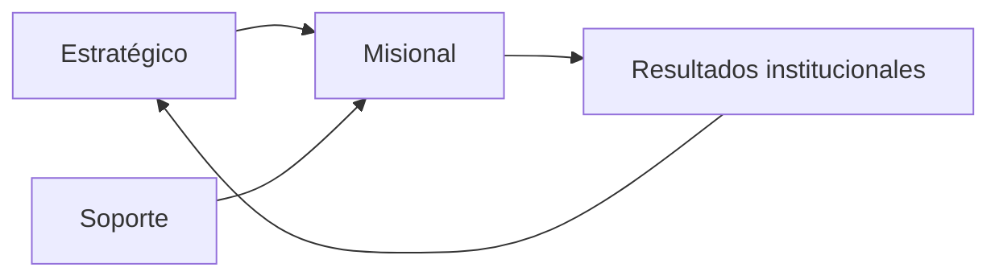

# README — Macroprocesos Institucionales

Macroprocesos propuestos para una institución educativa nacional (primaria y secundaria), alineados al sistema PredictEdu / Edge-PRIDE.

---

## 1) Macroproceso Estratégico

Define rumbo, metas y control institucional.

- **Planificación institucional:** PEI, PAT, metas de aprendizaje y permanencia escolar.
- **Gestión de indicadores:** asistencia, rendimiento, riesgo de deserción, cumplimiento curricular.
- **Gobierno de datos y calidad:** reglas de registro, trazabilidad, auditoría de información.
- **Mejora continua:** revisión de resultados, lecciones aprendidas y ajustes de política.

---

## 2) Macroproceso Misional (Núcleo Educativo)

Entrega valor directo al estudiante.

- **Admisión y matrícula:** registro del estudiante, sección, nivel y año escolar.
- **Gestión pedagógica:** programación, sesiones, evaluación y seguimiento por bimestre.
- **Monitoreo de riesgo educativo:** análisis de asistencia, notas y participación.
- **Predicción y alerta temprana (IA):** generación de niveles de riesgo y priorización.
- **Intervención y acompañamiento:** tutoría, contacto con familia, apoyo psicopedagógico.
- **Reforzamiento académico:** diseño, ejecución y evaluación de cursos/talleres de refuerzo.
- **Convivencia escolar y bienestar:** manejo de incidencias y acciones de protección.

---

## 3) Macroproceso de Soporte

Sostiene la operación académica y administrativa.

- **Gestión de talento humano:** docentes, tutores, capacitación, desempeño.
- **Gestión TIC y plataforma:** infraestructura, mantenimiento, seguridad y soporte.
- **Gestión documental y reportes:** SIAGIE, actas, reportes para UGEL y dirección.
- **Gestión de recursos y logística:** materiales, ambientes, conectividad y equipamiento.

---

## 4) Mapa de macroprocesos

---

## 5) Vinculación con PredictEdu

- **Estratégico:** usa tableros e indicadores (`indicadores_mensuales`) para decisiones.
- **Misional:** usa predicciones (`predicciones_riesgo`), alertas e intervenciones para reducir deserción.
- **Soporte:** mantiene datos, usuarios, secciones, SIAGIE y operación técnica del sistema.

---

## 6) KPI sugeridos por macroproceso

- **Estratégico:** % estudiantes en riesgo alto, tasa de permanencia, avance de metas PAT.
- **Misional:** mejora de notas post-reforzamiento, reducción de inasistencias, alertas cerradas.
- **Soporte:** disponibilidad del sistema, calidad de datos SIAGIE, tiempo de atención de incidencias.

---

## 7) Resumen ejecutivo

La institución se organiza en tres macroprocesos: **estratégico**, **misional** y **soporte**.  
PredictEdu se inserta principalmente en el macroproceso misional (alerta y acción pedagógica), con soporte transversal para gestión de datos y decisiones estratégicas.
