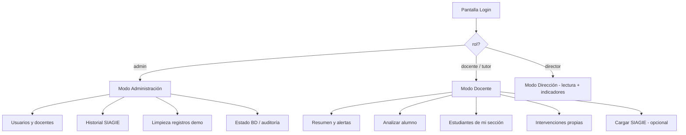
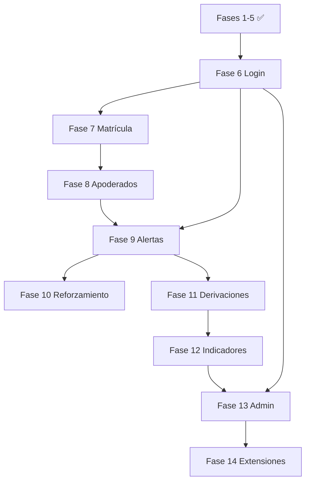

# Roadmap por fases — PredictEdu / Huacalle

Plan paso a paso para **usar las 23 tablas actuales** y ampliar el sistema sin romper lo ya entregado (Fases 1–5).

**Institución:** I.E.I. N° 32857 — Huacalle  
**BD:** `backend-sidecar/database/colegio.db` (esquema v4)

---

## Estado actual (Fases 1–5 ✅)

| Fase | Entregable |
|------|------------|
| **1** | Capa BD — `repository.py`, `init_database()` |
| **2** | Persistencia — predict/SIAGIE → SQLite |
| **3** | API + UI — Resumen, Estudiantes, Intervenciones, DNI |
| **4** | Filtros por riesgo + exportar reporte |
| **5** | QA — pytest (24 tests), registro de ejecución, CI GitHub Actions |

### Tablas ya operativas hoy

| Tabla | Uso actual |
|-------|------------|
| `schema_version` | Control de migraciones |
| `configuracion_anio_escolar` | Año activo al guardar evaluaciones (sin UI) |
| `estudiantes` | Registro, búsqueda DNI, listados |
| `evaluaciones` | Notas + asistencia % por bimestre |
| `predicciones_riesgo` | Motor ML + historial |
| `alertas_riesgo` | Dashboard y lista prioritarias |
| `intervenciones` | Pestaña Intervenciones (sin docente asignado) |
| `cargas_siagie` | Auditoría al subir Excel (sin pantalla de historial) |

### Tablas con solo datos de ejemplo (seed)

`docentes` (2) · `secciones` (4) · `cursos_reforzamiento` (2)

### Tablas sin uso en código ni datos

`matriculas` · `apoderados` · `estudiante_apoderado` · `usuarios_sistema` · `competencias_notas` · `asistencias_diarias` · `inscripciones_reforzamiento` · `seguimiento_alertas` · `sesiones_reforzamiento` · `derivaciones_externas` · `incidencias_convivencia` · `indicadores_mensuales`

---

## Mapa de cobertura (meta: 23/23 tablas)

| Fase | Tablas que activa | UI / API nueva |
|------|-------------------|----------------|
| **6** | `usuarios_sistema`, `docentes` | Login, sesión, roles |
| **7** | `secciones`, `matriculas` | Matrícula por aula; FK en `evaluaciones` |
| **8** | `apoderados`, `estudiante_apoderado` | Datos de familia; contacto desde alertas |
| **9** | `seguimiento_alertas`, `alertas_riesgo` (estados) | Bitácora por alerta; cerrar/atender |
| **10** | `cursos_reforzamiento`, `inscripciones_reforzamiento`, `sesiones_reforzamiento` | Talleres de reforzamiento |
| **11** | `derivaciones_externas`, `incidencias_convivencia` | UGEL/salud; convivencia escolar |
| **12** | `indicadores_mensuales`, `competencias_notas`, `asistencias_diarias` | Tablero mensual; datos ampliados |
| **13** | `cargas_siagie`, `configuracion_anio_escolar` | Panel admin + mantenimiento |
| **14** | *(tablas nuevas, ver abajo)* | Evidencias, auditoría, notificaciones |

Al terminar la **Fase 13**, las **23 tablas** del esquema v4 quedan integradas en flujos reales.

---

## Fase 6 — Login, roles y dos experiencias de uso

**Objetivo:** Separar **quién administra el sistema** de **quién trabaja con alumnos** cada día. Los **estudiantes** (alumnos del colegio) **no inician sesión** en PredictEdu: son registros en la tabla `estudiantes`. Los usuarios de la app son **personal del colegio** (`usuarios_sistema` + `docentes`).

### Personas y roles (MVP — 2 perfiles claros)

| Persona real | Rol en BD | Ejemplo Huacalle | Entra a la app para… |
|--------------|-----------|------------------|----------------------|
| **Administrador / soporte** | `admin` | Encargado de SIAGIE, TI o secretaría | Configurar, limpiar datos de prueba, ver historial de cargas, usuarios |
| **Docente / tutor** | `docente` | Profesora de 5°A, tutor de aula | Analizar alumnos, ver alertas de **su** sección, registrar intervenciones |
| *(fase posterior)* Director | `director` | Dirección | Igual que admin en lectura de indicadores; sin borrar datos |
| *(fase posterior)* Solo lectura | `lectura` | UGEL en visita | Ver reportes, sin modificar |

**Usuarios seed sugeridos:**

| Usuario | Contraseña (inicial) | Rol | Docente vinculado |
|---------|----------------------|-----|-------------------|
| `admin` | *(documentar en entrega)* | `admin` | Carlos Mendoza (cargo admin) |
| `mquispe` | *(documentar en entrega)* | `docente` | María Quispe (tutora 5°A) |

---

### Cómo se vería la app (dos “modos” tras el login)



#### Modo **Docente** (lo que ya tienes hoy + restricciones)

Pestañas visibles: **Resumen · Estudiantes · Intervenciones**

| Función | Permiso docente |
|---------|-----------------|
| Buscar/registrar alumno por DNI | ✅ |
| Analizar y guardar predicción | ✅ |
| Ver alertas prioritarias | ✅ (idealmente solo de su sección en Fase 7) |
| Registrar intervención | ✅ (queda su `docente_id`) |
| Cargar SIAGIE | ✅ o solo admin *(decisión abajo)* |
| Exportar reporte | ✅ (solo su sección cuando exista matrícula) |
| Borrar alumnos / ver usuarios | ❌ |
| Panel admin | ❌ |

#### Modo **Admin** (funciones nuevas de Fase 6)

Pestaña extra: **Administración** (solo `admin` y opcionalmente `director` en lectura)

| Función | Descripción |
|---------|-------------|
| **Usuarios** | Crear/desactivar cuentas, asignar rol y docente |
| **Docentes** | Listar personal, activar/desactivar |
| **Cargas SIAGIE** | Historial `cargas_siagie` (archivo, filas, errores, quién subió) |
| **Limpiar demos** | Borrar alumnos de prueba (Simulacion*, DNIs test) |
| **Estado del sistema** | Conteo por tabla (`audit_db_usage.py` en API) |
| **Año escolar** | Ver/cambiar año activo *(completo en Fase 13)* |

El admin **también puede** usar el modo docente (analizar, SIAGIE) si hace falta; en código: rol `admin` hereda permisos de `docente`.

---

### Matriz permisos API (backend)

| Endpoint | admin | docente | director | lectura |
|----------|:-----:|:-------:|:--------:|:-------:|
| `POST /api/auth/login` | ✅ | ✅ | ✅ | ✅ |
| `POST /api/predict` | ✅ | ✅ | ✅ | ❌ |
| `POST /api/upload_siagie` | ✅ | ⚙️ | ✅ | ❌ |
| `POST /api/estudiantes` | ✅ | ✅ | ✅ | ❌ |
| `GET /api/estudiantes` | ✅ | ✅ | ✅ | ✅ |
| `GET /api/reportes/exportar` | ✅ | ✅ | ✅ | ✅ |
| `POST /api/intervenciones` | ✅ | ✅ | ✅ | ❌ |
| `GET /api/admin/*` | ✅ | ❌ | 🔍 | ❌ |
| `DELETE /api/admin/*` | ✅ | ❌ | ❌ | ❌ |

⚙️ **Decisión pendiente:** ¿Solo `admin` sube SIAGIE o también el tutor?  
**Recomendación:** tutor de su sección puede subir; `admin` ve todas las cargas.

---

### Implementación técnica (paso a paso dentro de Fase 6)

**6.1 — Autenticación (ambos roles)**

- Tablas: `usuarios_sistema`, `docentes`
- `POST /api/auth/login` → token simple (JWT en header o cookie de sesión Flask)
- `GET /api/auth/me` → `{ username, rol, docente_id, nombre_completo, seccion_ids? }`
- `POST /api/auth/logout`
- Password hash con `werkzeug.security`
- Seed: usuarios `admin` y `mquispe`
- Middleware `@require_auth` y `@require_roles('admin')`

**6.2 — UI login + sesión**

- Pantalla login al abrir Tauri (si no hay token en `localStorage`)
- Header: “Hola, María · Tutora 5°A” o “Admin · Carlos”
- Botón **Cerrar sesión**
- Ocultar pestaña **Administración** si `rol !== 'admin'`

**6.3 — Panel Admin (solo admin)**

- `GET /api/admin/cargas-siagie`
- `GET /api/admin/resumen-bd`
- `DELETE /api/admin/estudiantes/demo`
- `GET/POST /api/admin/usuarios` (listar y crear; sin UI compleja al inicio)
- Pantalla Admin en React con las 4 tarjetas anteriores

**6.4 — Trazabilidad docente**

- `POST /api/intervenciones` → rellena `docente_id` desde sesión
- `POST /api/upload_siagie` → rellena `cargas_siagie.subido_por_id`
- Tests: docente no accede a `/api/admin/*` → 403

---

### Qué NO es Fase 6 (va después)

| Tema | Fase |
|------|------|
| Matrícula y filtrar por sección del tutor | 7 |
| Apoderados en ficha | 8 |
| Portal para padres/alumnos | 14+ (opcional) |

---

### Criterios de aceptación Fase 6

- [x] Login con `admin` y `mquispe`; contraseña incorrecta → error claro
- [x] Docente ve Resumen/Estudiantes/Intervenciones; **no** ve Administración
- [x] Admin ve todo + pestaña Administración
- [x] Intervenciones y SIAGIE guardan quién actuó
- [x] Admin puede borrar registros demo desde UI
- [x] Tests de permisos (403 para docente en rutas admin)

### Tests

- Login ok / fallido / usuario inactivo
- `GET /api/admin/resumen-bd` como admin → 200; como docente → 403

---

## Fase 7 — Matrícula y sección

**Objetivo:** Cada alumno pertenece a un aula (ej. 5°A primaria Huacalle).

**Tablas:** `secciones`, `matriculas` (+ enlazar `evaluaciones.matricula_id`)

### Backend
- `GET /api/secciones` — por año activo
- `POST /api/estudiantes` ampliado — opcional `seccion_id` → crea `matricula`
- `GET /api/estudiantes/:id/ficha` — alumno + sección + apoderado (Fase 8)

### Frontend
- Al registrar: selector **Nivel · Grado · Sección** (usa las 4 secciones del seed)
- Columna “Sección” en tabla Estudiantes
- Filtro por sección en listado y export

### Criterios de aceptación
- [ ] Matrícula única por alumno y año escolar
- [ ] Evaluaciones guardan `matricula_id` cuando existe

---

## Fase 8 — Apoderados y contacto familiar

**Objetivo:** Datos para prevención de deserción (llamadas, visitas).

**Tablas:** `apoderados`, `estudiante_apoderado`

### Backend
- `POST /api/estudiantes/:id/apoderado` — crear/vincular apoderado principal
- `GET /api/estudiantes/:id/apoderado`

### Frontend
- Bloque “Apoderado” en registro / ficha del alumno (nombre, DNI, teléfono, parentesco)
- En alertas de riesgo alto: mostrar teléfono y botón “Copiar contacto”

### Criterios de aceptación
- [ ] Un apoderado principal por estudiante
- [ ] Teléfono visible en alertas prioritarias

---

## Fase 9 — Ciclo completo de alertas

**Objetivo:** Trazabilidad docente sobre cada alerta (no solo la intervención genérica).

**Tablas:** `seguimiento_alertas`, estados en `alertas_riesgo`

### Backend
- `POST /api/alertas/:id/seguimiento` — acción, detalle, docente
- `PATCH /api/alertas/:id` — `nueva` → `en_revision` → `atendida` → `cerrada`
- `GET /api/alertas/:id/historial`

### Frontend
- En cada alerta: timeline de acciones
- Botones “Marcar en revisión” / “Cerrar alerta”
- “Registrar acción” crea fila en `seguimiento_alertas` (además de intervención si aplica)

### Criterios de aceptación
- [ ] Toda acción desde alerta queda en `seguimiento_alertas`
- [ ] Alertas cerradas dejan de salir en prioritarias

---

## Fase 10 — Reforzamiento escolar

**Objetivo:** Inscribir alumnos en riesgo en talleres (matemática, comunicación).

**Tablas:** `cursos_reforzamiento`, `inscripciones_reforzamiento`, `sesiones_reforzamiento`

### Backend
- `GET /api/cursos-reforzamiento`
- `POST /api/cursos-reforzamiento/:id/inscripciones`
- `POST /api/cursos-reforzamiento/:id/sesiones`
- `PATCH /api/inscripciones/:id` — resultado (`mejoro`, `en_proceso`, etc.)

### Frontend
- Pestaña **Reforzamiento**: cursos, cupos, alumnos inscritos
- Desde alerta: “Inscribir en taller” (pre-selecciona curso por área débil)
- Registro de sesiones por fecha y tema

### Criterios de aceptación
- [ ] Inscripción ligada a `prediccion_id` y motivo `riesgo_alto` / `bajo_rendimiento`
- [ ] Sesiones visibles en historial del curso

---

## Fase 11 — Derivaciones e incidencias

**Objetivo:** Casos que salen del aula (UGEL, DEMUNA, salud) y convivencia.

**Tablas:** `derivaciones_externas`, `incidencias_convivencia`

### Backend
- `POST /api/derivaciones` — desde intervención o alerta
- `GET /api/derivaciones?estado=pendiente`
- `POST /api/incidencias` — tipo, severidad, descripción
- `GET /api/estudiantes/:id/incidencias`

### Frontend
- Formulario derivación (entidad, motivo, estado)
- Formulario incidencia de convivencia
- Lista en ficha del estudiante

### Criterios de aceptación
- [ ] Derivación opcionalmente enlazada a `intervencion_id`
- [ ] Incidencias filtrables por severidad

---

## Fase 12 — Indicadores y datos académicos ampliados

**Objetivo:** Tablero para dirección/UGEL y más señales para el modelo a futuro.

**Tablas:** `indicadores_mensuales`, `competencias_notas`, `asistencias_diarias`

### Backend
- `POST /api/indicadores/calcular` — agrega mes actual por sección (job o botón admin)
- `GET /api/indicadores?anio=&mes=`
- Al guardar evaluación: opcional filas en `competencias_notas` (otras áreas)
- `POST /api/asistencias-diarias` — lote por fecha; recalcular % en evaluación

### Frontend
- Sección **Indicadores**: gráfico mensual (% riesgo alto, intervenciones, derivaciones)
- Formulario ampliado de notas por competencia (opcional)
- Vista calendario asistencia (futuro cercano)

### Criterios de aceptación
- [ ] `indicadores_mensuales` con al menos un mes calculado
- [ ] Export reporte incluye indicadores por sección

---

## Fase 13 — Panel administración y mantenimiento

**Objetivo:** Completar la Fase 6 “admin” original: operación del colegio.

**Tablas:** `cargas_siagie`, `configuracion_anio_escolar` (+ gestión global)

### Backend
- `GET /api/admin/cargas-siagie` — historial de importaciones
- `DELETE /api/admin/estudiantes/demo` — borrar registros de prueba (filtro por nombre/DNI)
- `GET/POST /api/admin/anio-escolar` — activar año
- `GET /api/admin/resumen-bd` — conteos por tabla (script `audit_db_usage.py`)

### Frontend
- Pestaña **Admin** (solo rol `admin` / `director`)
- Historial SIAGIE, limpieza de demos, cambio de año escolar

### Criterios de aceptación
- [ ] Admin ve historial de cargas SIAGIE
- [ ] Puede eliminar alumnos de prueba sin romper FK
- [ ] Año escolar configurable desde UI

---

## Fase 14 — Extensiones opcionales (tablas nuevas)

Si el proyecto académico pide **más allá de las 23 tablas**, candidatos coherentes con Huacalle:

| Tabla propuesta | Propósito |
|-----------------|-----------|
| `auditoria_sistema` | Log de quién borró/editó registros (admin) |
| `archivos_adjuntos` | Evidencias PDF/fotos en intervenciones o derivaciones |
| `notificaciones` | Recordatorios (seguimiento pendiente, derivación sin respuesta) |
| `visitas_domiciliarias` | Registro de visitas a familia (fecha, resultado) |
| `metas_institucionales` | Metas UGEL (% asistencia, meta deserción) vs real |
| `capacitaciones_docentes` | Formación en uso del sistema y convivencia |

Implementar solo si hay requisito explícito en la tesis o entrega.

---

## Orden recomendado y dependencias



| Orden | Fase | Por qué aquí |
|-------|------|----------------|
| **1** | **6 — Login** | Desbloquea docente en intervenciones, SIAGIE y admin |
| 2 | 7 — Matrícula | Contexto escolar real (5°A) |
| 3 | 8 — Apoderados | Contacto familia en alertas |
| 4 | 9 — Seguimiento alertas | Cierra el ciclo predict → actuar |
| 5 | 10 — Reforzamiento | Usa predicción + matrícula |
| 6 | 11 — Derivaciones / incidencias | Casos complejos |
| 7 | 12 — Indicadores | Necesita datos de fases anteriores |
| 8 | 13 — Admin | Mantenimiento cuando todo está conectado |
| 9 | 14 — Extensiones | Opcional académico |

---

## Con qué empezamos

### ▶ Siguiente paso: **Fase 6 — Login + Admin vs Docente**

Implementar en este orden:

1. **6.1** Login API + seed `admin` y `mquispe`
2. **6.2** Pantalla login y ocultar Admin según rol
3. **6.3** Pestaña Administración (historial SIAGIE, limpiar demos, resumen BD)
4. **6.4** Trazabilidad en intervenciones y cargas

Cuando confirmes, arrancamos por **6.1** en el código.

---

## Comando útil — auditoría de tablas

```powershell
venv\Scripts\python.exe scripts\audit_db_usage.py
```

Muestra filas por tabla para verificar avance tras cada fase.

---

*Última actualización: junio 2026 — esquema BD v4*
