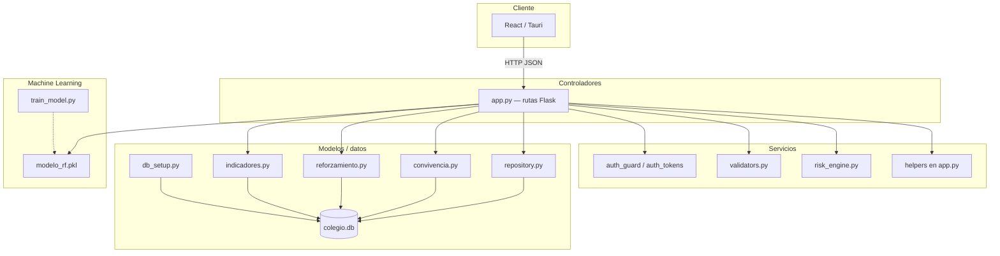
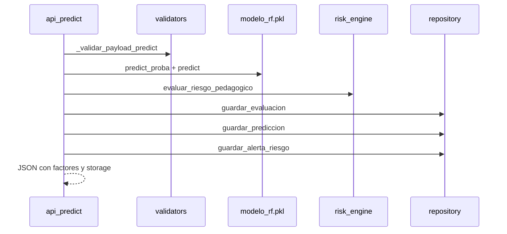

# Arquitectura del backend — PredictEdu

## 1. Visión general

El backend es un **sidecar Flask** que expone una API REST JSON para la aplicación PredictEdu. Persiste datos en **SQLite**, ejecuta **predicciones de riesgo** con un Random Forest serializado y aplica **reglas pedagógicas** complementarias.



---

## 2. Estructura del proyecto backend

```
backend-sidecar/
├── app.py                    # Controladores (API REST) + orquestación
├── requirements.txt          # Dependencias Python
│
├── auth_guard.py             # Servicio: autorización y roles
├── auth_tokens.py            # Servicio: tokens de sesión
├── validators.py             # Servicio: validación de entrada
├── risk_engine.py            # Servicio: reglas pedagógicas de riesgo
├── security_headers.py       # Middleware: cabeceras HTTP de seguridad
│
├── database/
│   ├── __init__.py           # Reexporta API pública del paquete
│   ├── db_setup.py           # Esquema SQLite, migraciones, seed
│   ├── repository.py         # Modelo/repositorio principal (~2 100 líneas)
│   ├── convivencia.py        # Modelo: incidencias y derivaciones
│   ├── reforzamiento.py      # Modelo: cursos, inscripciones, sesiones
│   └── indicadores.py        # Modelo: indicadores mensuales y competencias
│
├── ml_models/
│   ├── modelo_rf.pkl         # Modelo entrenado (Random Forest)
│   └── train_model.py        # Script de entrenamiento offline
│
└── uploads/
    └── reforzamiento/        # Archivos subidos (PDF, DOC, MP4)
```

### 2.1 Arranque

```python
# app.py (simplificado)
app = Flask(__name__)
CORS(app)
register_security_headers(app)
init_database()          # Crea/actualiza colegio.db

@app.before_request
def protect_api_routes():  # Exige JWT salvo rutas públicas
    ...

_load_model()            # joblib.load(modelo_rf.pkl)
app.run(host="127.0.0.1", port=5000)
```

Variables de entorno relevantes:

| Variable | Efecto |
|----------|--------|
| `PREDICTEDU_AUTH=0` | Desactiva auth (usuario admin de prueba) |
| `PREDICTEDU_SECRET_KEY` | Clave para firmar tokens |

---

## 3. Controladores

Los **controladores** son las funciones decoradas con `@app.get`, `@app.post`, `@app.patch` y `@app.delete` en **`app.py`**. Cada una:

1. Lee `request` (JSON, query params, archivos).
2. Valida con `validators.py` o helpers locales.
3. Comprueba permisos vía `get_current_user()` / `@require_roles`.
4. Delega en repositorio o servicio.
5. Devuelve `jsonify(...)` o `send_file(...)`.

### 3.1 Middleware global

| Hook | Función |
|------|---------|
| `@app.before_request` → `protect_api_routes` | Rechaza peticiones sin token (401) excepto rutas públicas |
| `register_security_headers` | Añade cabeceras de seguridad HTTP |
| CORS | Permite origen del frontend (Vite/Tauri) |

### 3.2 Rutas públicas (sin autenticación)

| Método | Ruta | Controlador | Descripción |
|--------|------|-------------|-------------|
| GET | `/api/status` | `api_status` | Estado del servidor, modelo y BD |
| POST | `/api/auth/login` | `api_login` | Inicio de sesión |
| POST | `/api/auth/recuperar` | `api_recuperar` | Recuperación de contraseña |

### 3.3 Autenticación y perfil

| Método | Ruta | Controlador |
|--------|------|-------------|
| GET | `/api/auth/me` | `api_auth_me` |

### 3.4 Dashboard y estructura escolar

| Método | Ruta | Controlador | Rol |
|--------|------|-------------|-----|
| GET | `/api/resumen` | `api_resumen` | autenticado |
| GET | `/api/secciones` | `api_secciones` | autenticado |

### 3.5 Estudiantes y matrícula

| Método | Ruta | Controlador |
|--------|------|-------------|
| GET | `/api/estudiantes` | `api_estudiantes` |
| POST | `/api/estudiantes` | `api_registrar_estudiante` |
| GET | `/api/estudiantes/buscar` | `api_buscar_estudiante` |
| GET | `/api/estudiantes/<id>/apoderado` | `api_obtener_apoderado` |
| POST | `/api/estudiantes/<id>/apoderado` | `api_guardar_apoderado` |
| GET | `/api/estudiantes/<id>/incidencias` | `api_incidencias_estudiante` |
| DELETE | `/api/estudiantes/invalidos` | `api_eliminar_estudiantes_invalidos` |

### 3.6 Predicción y evaluación

| Método | Ruta | Controlador |
|--------|------|-------------|
| POST | `/api/predict` | `api_predict` |
| POST | `/api/asistencias-diarias` | `api_asistencias_diarias` |
| GET | `/api/evaluaciones/<id>/competencias` | `api_competencias_evaluacion` |

### 3.7 Alertas e intervenciones

| Método | Ruta | Controlador |
|--------|------|-------------|
| PATCH | `/api/alertas/<id>` | `api_actualizar_alerta` |
| GET | `/api/alertas/<id>/historial` | `api_historial_alerta` |
| POST | `/api/alertas/<id>/seguimiento` | `api_seguimiento_alerta` |
| GET | `/api/intervenciones` | `api_intervenciones` |
| POST | `/api/intervenciones` | `api_crear_intervencion` |
| PATCH | `/api/intervenciones/<id>` | `api_actualizar_intervencion` |

### 3.8 Reforzamiento

| Método | Ruta | Controlador |
|--------|------|-------------|
| GET | `/api/cursos-reforzamiento` | `api_cursos_reforzamiento` |
| GET | `/api/cursos-reforzamiento/<id>` | `api_curso_reforzamiento` |
| POST | `/api/cursos-reforzamiento/<id>/inscripciones` | `api_inscribir_reforzamiento` |
| POST | `/api/cursos-reforzamiento/<id>/sesiones` | `api_sesion_reforzamiento` |
| GET/POST | `/api/cursos-reforzamiento/<id>/materiales` | `api_materiales_*` |
| GET | `/api/materiales-reforzamiento/<id>/descargar` | `api_descargar_material` |
| PATCH | `/api/inscripciones/<id>` | `api_actualizar_inscripcion` |

### 3.9 Convivencia

| Método | Ruta | Controlador |
|--------|------|-------------|
| GET/POST | `/api/incidencias` | `api_incidencias` |
| GET/POST | `/api/derivaciones` | `api_derivaciones` |
| PATCH | `/api/derivaciones/<id>` | `api_actualizar_derivacion` |

### 3.10 Indicadores y reportes

| Método | Ruta | Controlador |
|--------|------|-------------|
| GET | `/api/indicadores` | `api_indicadores_list` |
| POST | `/api/indicadores/calcular` | `api_indicadores_calcular` |
| GET | `/api/reportes/exportar` | `api_exportar_reporte` |

### 3.11 Carga SIAGIE

| Método | Ruta | Controlador |
|--------|------|-------------|
| POST | `/api/upload_siagie` | `api_upload_siagie` |

### 3.12 Administración (`@require_roles("admin")`)

| Método | Ruta | Controlador |
|--------|------|-------------|
| GET | `/api/admin/resumen-bd` | `api_admin_resumen_bd` |
| GET | `/api/admin/cargas-siagie` | `api_admin_cargas_siagie` |
| GET | `/api/admin/usuarios` | `api_admin_usuarios` |
| GET | `/api/admin/docentes` | `api_admin_docentes` |
| GET | `/api/admin/secciones` | `api_admin_secciones` |
| DELETE | `/api/admin/estudiantes/demo` | `api_admin_eliminar_demo` |
| GET/POST | `/api/admin/anio-escolar` | `api_admin_anio_escolar` |

### 3.13 Helpers de controlador en `app.py`

Funciones privadas que orquestan lógica entre servicios y repositorio:

| Función | Rol |
|---------|-----|
| `_resolve_seccion_scope` | Filtra por sección según rol docente y query params |
| `_resolve_seccion_scope_from_payload` | Valida sección en POST de matrícula |
| `_reparar_matriculas_docente_actual` | Repara matrículas pendientes al inicio de request |
| `_validar_payload_predict` | Valida cuerpo de `/api/predict` |
| `_build_features` | Convierte payload a vector para el modelo ML |
| `_analizar_riesgo` | Combina ML + `risk_engine` |
| `_persist_prediction_record` | Guarda evaluación, predicción y alerta |
| `_resolve_student_identity` | Resuelve alumno por id o DNI |
| `_build_reporte_dataframe` | Prepara Excel de exportación |
| `_indicadores_scope_for_user` | Alcance de indicadores por rol |

---

## 4. Modelos (capa de datos)

En este proyecto, **modelo** significa la capa de **acceso a datos**: funciones que ejecutan SQL, mapean filas a `dict` y encapsulan reglas de persistencia. No hay clases ORM.

### 4.1 `database/db_setup.py` — esquema y seed

| Responsabilidad | Detalle |
|-----------------|---------|
| Creación de tablas | 24 tablas (`SCHEMA_VERSION = 5`) |
| Migraciones | `_migrate_legacy_estudiantes`, reparación de FK |
| Seed inicial | Docentes, secciones, cursos demo, usuarios `admin` / `mquispe` |
| Utilidades | `get_db_path()`, `list_tables()`, `setup_database()` |

Ver documentación completa del ER en [../base-de-datos/modelo-datos.md](../base-de-datos/modelo-datos.md).

### 4.2 `database/repository.py` — repositorio principal

Conexión y utilidades base:

| Función | Descripción |
|---------|-------------|
| `get_connection()` | Context manager SQLite con `foreign_keys=ON` |
| `init_database()` | Wrapper de `setup_database()` |
| `get_database_status()` | Estado para `/api/status` |
| `get_active_anio_escolar_id()` | Año escolar vigente |

**Entidades principales:**

| Dominio | Funciones clave |
|---------|-----------------|
| Año escolar | `listar_anios_escolares`, `activar_anio_escolar` |
| Secciones | `listar_secciones_activas`, `listar_secciones_institucional`, `obtener_seccion_ids_tutor`, `seccion_pertenece_tutor` |
| Matrícula | `matricular_estudiante`, `obtener_matricula_id_activa`, `reparar_matriculas_pendientes_tutor` |
| Estudiantes | `registrar_estudiante`, `buscar_estudiante_por_dni`, `buscar_o_crear_estudiante`, `listar_estudiantes_detallado`, `contar_estudiantes_filtrados` |
| Apoderados | `guardar_apoderado_principal`, `obtener_apoderado_principal` |
| Evaluaciones | `guardar_evaluacion` |
| Predicciones | `guardar_prediccion`, `obtener_ultima_prediccion` |
| Alertas | `guardar_alerta_riesgo`, `actualizar_estado_alerta`, `registrar_seguimiento_alerta`, `listar_seguimiento_alerta`, `consolidar_alertas_duplicadas` |
| Intervenciones | `registrar_intervencion`, `actualizar_estado_intervencion`, `listar_intervenciones` |
| Dashboard | `obtener_resumen_dashboard`, `obtener_alertas_prioritarias` |
| Usuarios | `autenticar_usuario`, `obtener_usuario_por_id`, `listar_usuarios_sistema`, `listar_docentes` |
| SIAGIE | `registrar_carga_siagie`, `listar_cargas_siagie` |
| Mantenimiento | `eliminar_estudiantes_demo`, `obtener_conteo_tablas` |

**Patrón de mapeo:**

```python
def _row_to_dict(row: sqlite3.Row | None) -> dict[str, Any] | None:
    if row is None:
        return None
    return dict(row)
```

Las consultas complejas (joins con sección, última predicción, apoderado) viven en `listar_estudiantes_detallado` y funciones similares.

### 4.3 `database/convivencia.py`

| Función | Tabla(s) |
|---------|----------|
| `crear_derivacion_externa` | `derivaciones_externas` |
| `listar_derivaciones` | `derivaciones_externas` + joins |
| `actualizar_derivacion` | `derivaciones_externas` |
| `crear_incidencia_convivencia` | `incidencias_convivencia` |
| `listar_incidencias` | `incidencias_convivencia` + joins |

Validaciones internas: tipo de incidencia, severidad, estado de derivación, entidad destino.

### 4.4 `database/reforzamiento.py`

| Función | Tabla(s) |
|---------|----------|
| `listar_cursos_reforzamiento` | `cursos_reforzamiento` |
| `obtener_curso_reforzamiento` | curso + inscripciones + sesiones |
| `inscribir_estudiante_reforzamiento` | `inscripciones_reforzamiento` |
| `actualizar_inscripcion_reforzamiento` | `inscripciones_reforzamiento` |
| `registrar_sesion_reforzamiento` | `sesiones_reforzamiento` |
| `crear_material_reforzamiento` | `materiales_reforzamiento` |
| `listar_materiales_curso` | `materiales_reforzamiento` |
| `inferir_motivo_inscripcion` | lógica de negocio auxiliar |
| `inferir_area_curso` | sugerencia de taller por área |

### 4.5 `database/indicadores.py`

| Función | Tabla(s) |
|---------|----------|
| `calcular_indicadores_mensuales` | agrega y escribe `indicadores_mensuales` |
| `listar_indicadores` | lectura con filtros por sección/año/mes |
| `guardar_competencias_notas` | `competencias_notas` |
| `listar_competencias_evaluacion` | lectura por evaluación |
| `registrar_asistencias_diarias` | `asistencias_diarias` + recálculo de evaluación |

---

## 5. Servicios

Los **servicios** contienen lógica de negocio **sin acoplarse a HTTP**. Los controladores los invocan; los modelos los usan indirectamente o en paralelo.

### 5.1 `validators.py` — validación de entrada

Funciones puras reutilizadas por controladores y repositorio:

| Función | Validación |
|---------|------------|
| `normalizar_dni` | 8 dígitos numéricos |
| `validar_nombre_completo` | Longitud y formato de nombre |
| `validar_asistencias` | 0–100 |
| `validar_participacion` | 0–10 |
| `validar_nota_literal` | AD, A, B, C |
| `validar_bimestre` | 1–4 |
| `validar_telefono` | 9 dígitos, empieza con 9 |
| `validar_parentesco` | padre, madre, apoderado, tutor, otro |
| `validar_username` | Formato de usuario |
| `validar_dni_opcional` | DNI opcional de apoderado |

Lanza `ValueError` con mensaje en español; el controlador lo convierte en HTTP 400.

### 5.2 `risk_engine.py` — motor pedagógico de riesgo

Complementa la salida del Random Forest con **reglas interpretables** para docentes:

| Función | Descripción |
|---------|-------------|
| `nota_a_puntaje` | Mapeo AD=4, A=3, B=2, C=1 |
| `nivel_riesgo_desde_probabilidad` | Umbrales alto ≥0.7, medio ≥0.45 |
| `etiqueta_desde_nivel` | Texto "Alto Riesgo", "Riesgo Moderado", etc. |
| `evaluar_riesgo_pedagogico` | Combina asistencia, notas, participación y proba ML |

Retorna: `probabilidad_alto`, `nivel_riesgo`, `etiqueta`, `factores` (lista de strings explicativos).

### 5.3 `auth_tokens.py` — servicio de sesión

| Función | Descripción |
|---------|-------------|
| `create_access_token` | Genera token firmado (12 h) |
| `decode_access_token` | Valida y decodifica payload |
| `extract_bearer_token` | Lee `Authorization: Bearer` o `X-Auth-Token` |

### 5.4 `auth_guard.py` — servicio de autorización

| Función / decorador | Descripción |
|---------------------|-------------|
| `get_current_user` | Resuelve usuario desde token + BD |
| `auth_is_public` | Rutas exentas de auth |
| `@require_roles("admin")` | Restringe endpoints administrativos |
| `user_can_write` / `user_is_admin` | Helpers de permiso |

### 5.5 `security_headers.py`

Registra middleware Flask que añade cabeceras (`X-Content-Type-Options`, `X-Frame-Options`, etc.).

### 5.6 Servicio de predicción (orquestado en `app.py`)

Flujo de `POST /api/predict`:



### 5.7 Servicio de importación SIAGIE (`api_upload_siagie`)

1. Recibe archivo Excel/CSV.
2. Normaliza columnas (`_normalize_column_name`).
3. Por fila: busca/crea estudiante, guarda evaluación, ejecuta predicción.
4. Registra metadatos en `cargas_siagie`.

### 5.8 Servicio de exportación (`api_exportar_reporte`)

1. Consulta `listar_estudiantes_detallado` con filtros.
2. Construye `DataFrame` pandas (`_build_reporte_dataframe`).
3. Añade hoja de indicadores si aplica.
4. Devuelve `.xlsx` o `.csv` vía `send_file`.

### 5.9 ML offline (`ml_models/train_model.py`)

Script independiente del servidor: entrena Random Forest con datos de ejemplo y genera `modelo_rf.pkl`. No es un servicio en runtime, pero alimenta el servicio de predicción.

---

## 6. Flujo request → response (ejemplo)

**Registrar alumno** — `POST /api/estudiantes`

```
1. protect_api_routes → get_current_user()
2. api_registrar_estudiante
   ├── normalizar_dni / validar_nombre_completo (validators)
   ├── _resolve_seccion_scope_from_payload (helper)
   ├── registrar_estudiante (repository)
   └── guardar_apoderado_principal (repository, opcional)
3. jsonify 201 { ok, estudiante, apoderado? }
```

**Alcance docente** — en listados se aplica:

```
_resolve_seccion_scope()
  → si rol docente: tutor_docente_id = user.docente_id
  → si query seccion_id: validar seccion_pertenece_tutor
  → listar_estudiantes_detallado(..., tutor_docente_id=...)
```

---

## 7. Dependencias (`requirements.txt`)

| Paquete | Uso |
|---------|-----|
| Flask | Servidor HTTP y routing |
| flask-cors | CORS para frontend |
| pandas | SIAGIE, exportación Excel |
| scikit-learn | Inferencia ML |
| joblib | Carga de `modelo_rf.pkl` |
| openpyxl | Escritura `.xlsx` |
| werkzeug | Hash de contraseñas (seed) |
| itsdangerous | Tokens de sesión (vía Flask) |

---

## 8. Relación con otras documentaciones

| Documento | Contenido complementario |
|-----------|-------------------------|
| [../base-de-datos/modelo-datos.md](../base-de-datos/modelo-datos.md) | Diagrama ER y catálogo de tablas |
| [../frontend/arquitectura-frontend.md](../frontend/arquitectura-frontend.md) | Consumo de la API desde React |
| `tests/caja-negra/` | Pruebas HTTP de los controladores |

---

*Documento alineado con `backend-sidecar/` — esquema SQLite v5.*
