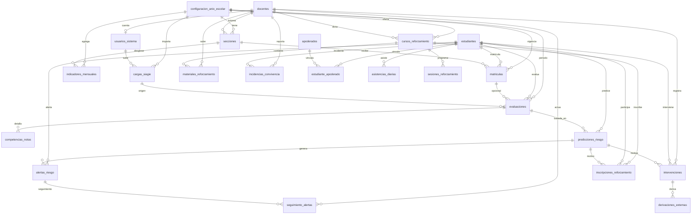
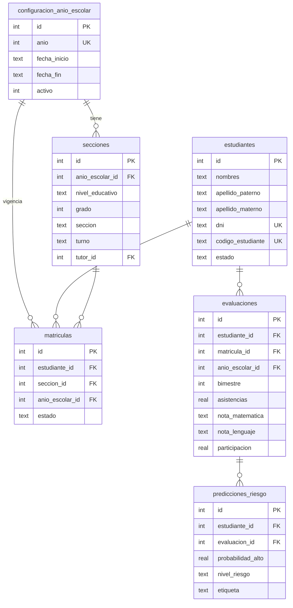
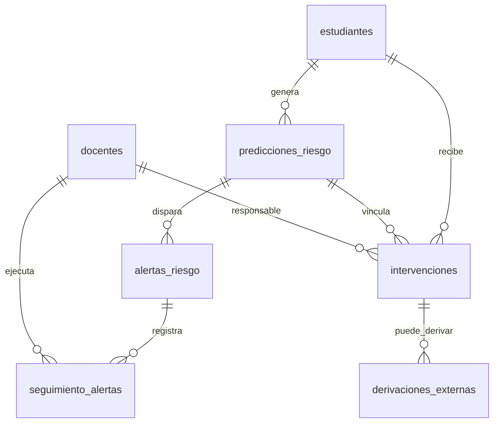

# Modelo de datos — PredictEdu

## 1. Visión general

PredictEdu persiste la información en una base **SQLite** monolítica (`colegio.db`). El diseño sigue un modelo **relacional normalizado** orientado a:

- Gestionar la **población estudiantil** y su ubicación en secciones por año escolar.
- Registrar **evaluaciones** y **predicciones de riesgo** de deserción.
- Dar seguimiento a **alertas**, **intervenciones**, **reforzamiento** y **convivencia escolar**.
- Calcular **indicadores mensuales** agregados por sección o institución.

La fuente de verdad del esquema es `backend-sidecar/database/db_setup.py` (versión **5**).

---

## 2. Modelo entidad–relación

### 2.1 Diagrama general (por dominios)



### 2.2 Diagrama núcleo académico



### 2.3 Diagrama intervención y riesgo



---

## 3. Catálogo de tablas

### 3.1 Control y configuración

#### `schema_version`
| Campo | Tipo | Restricción | Descripción |
|-------|------|-------------|-------------|
| **id** | INTEGER | **PK**, AUTOINCREMENT | Identificador del registro de migración |
| version | INTEGER | NOT NULL | Número de versión del esquema aplicado |
| applied_at | TEXT | NOT NULL, DEFAULT now | Fecha/hora de aplicación |

**Relaciones:** ninguna (tabla de control).

---

#### `configuracion_anio_escolar`
| Campo | Tipo | Restricción | Descripción |
|-------|------|-------------|-------------|
| **id** | INTEGER | **PK**, AUTOINCREMENT | Identificador interno del año escolar |
| anio | INTEGER | NOT NULL, **UNIQUE** | Año calendario (ej. 2026) |
| fecha_inicio | TEXT | | Inicio del año lectivo |
| fecha_fin | TEXT | | Fin del año lectivo |
| activo | INTEGER | 0 o 1 | Marca el año escolar vigente |
| created_at | TEXT | NOT NULL | Registro de creación |

**Relaciones:**
- 1 → N con `secciones`, `matriculas`, `evaluaciones`, `cursos_reforzamiento`, `indicadores_mensuales`, `cargas_siagie`

---

### 3.2 Personal y acceso

#### `docentes`
| Campo | Tipo | Restricción | Descripción |
|-------|------|-------------|-------------|
| **id** | INTEGER | **PK**, AUTOINCREMENT | Identificador del docente |
| nombres | TEXT | NOT NULL | Nombres |
| apellido_paterno | TEXT | NOT NULL | Apellido paterno |
| apellido_materno | TEXT | | Apellido materno |
| dni | TEXT | **UNIQUE** | DNI del docente |
| especialidad | TEXT | | Área de especialidad |
| cargo | TEXT | docente, tutor, director, psicologo, admin | Rol institucional |
| telefono | TEXT | | Contacto |
| email | TEXT | | Correo |
| activo | INTEGER | 0 o 1 | Estado laboral |
| created_at | TEXT | NOT NULL | Registro de creación |

**Relaciones:**
- 1 → N con `secciones` (como tutor)
- 1 → 0..1 con `usuarios_sistema`
- 1 → N con `intervenciones`, `cursos_reforzamiento`, `seguimiento_alertas`, `materiales_reforzamiento`, `incidencias_convivencia`

---

#### `usuarios_sistema`
| Campo | Tipo | Restricción | Descripción |
|-------|------|-------------|-------------|
| **id** | INTEGER | **PK**, AUTOINCREMENT | Identificador de usuario |
| docente_id | INTEGER | **FK** → `docentes.id`, ON DELETE SET NULL | Docente asociado (opcional) |
| username | TEXT | NOT NULL, **UNIQUE** | Nombre de usuario para login |
| password_hash | TEXT | NOT NULL | Contraseña hasheada (Werkzeug) |
| rol | TEXT | admin, director, docente, lectura | Rol de acceso en la aplicación |
| activo | INTEGER | 0 o 1 | Cuenta habilitada |
| ultimo_acceso | TEXT | | Último inicio de sesión |
| created_at | TEXT | NOT NULL | Registro de creación |

**Relaciones:**
- N → 1 con `docentes`
- 1 → N con `cargas_siagie` (como `subido_por_id`)

---

### 3.3 Estructura escolar

#### `secciones`
| Campo | Tipo | Restricción | Descripción |
|-------|------|-------------|-------------|
| **id** | INTEGER | **PK**, AUTOINCREMENT | Identificador de sección |
| anio_escolar_id | INTEGER | **FK** → `configuracion_anio_escolar.id`, CASCADE | Año escolar |
| nivel_educativo | TEXT | primaria, secundaria | Nivel |
| grado | INTEGER | 1–6 | Grado |
| seccion | TEXT | DEFAULT 'A' | Letra de sección |
| turno | TEXT | manana, tarde | Turno |
| tutor_id | INTEGER | **FK** → `docentes.id`, SET NULL | Tutor responsable |
| created_at | TEXT | NOT NULL | Registro de creación |

**Clave alternativa:** UNIQUE (`anio_escolar_id`, `nivel_educativo`, `grado`, `seccion`, `turno`)

**Relaciones:**
- N → 1 con `configuracion_anio_escolar` y `docentes`
- 1 → N con `matriculas`, `indicadores_mensuales`

---

#### `matriculas`
| Campo | Tipo | Restricción | Descripción |
|-------|------|-------------|-------------|
| **id** | INTEGER | **PK**, AUTOINCREMENT | Identificador de matrícula |
| estudiante_id | INTEGER | **FK** → `estudiantes.id`, CASCADE | Alumno |
| seccion_id | INTEGER | **FK** → `secciones.id`, RESTRICT | Sección asignada |
| anio_escolar_id | INTEGER | **FK** → `configuracion_anio_escolar.id`, CASCADE | Año escolar |
| fecha_matricula | TEXT | | Fecha de matrícula |
| estado | TEXT | matriculado, retirado, trasladado | Estado de la matrícula |
| created_at | TEXT | NOT NULL | Registro de creación |

**Clave alternativa:** UNIQUE (`estudiante_id`, `anio_escolar_id`) — un alumno, una matrícula activa por año.

**Relaciones:**
- N → 1 con `estudiantes`, `secciones`, `configuracion_anio_escolar`
- 1 → N con `evaluaciones`, `asistencias_diarias` (opcional)

---

### 3.4 Estudiantes y apoderados

#### `estudiantes`
| Campo | Tipo | Restricción | Descripción |
|-------|------|-------------|-------------|
| **id** | INTEGER | **PK**, AUTOINCREMENT | Identificador del estudiante |
| nombres | TEXT | NOT NULL | Nombres |
| apellido_paterno | TEXT | NOT NULL | Apellido paterno |
| apellido_materno | TEXT | | Apellido materno |
| dni | TEXT | **UNIQUE** | DNI peruano (8 dígitos) |
| codigo_estudiante | TEXT | **UNIQUE** | Código SIAGIE u otro |
| fecha_nacimiento | TEXT | | Fecha de nacimiento |
| genero | TEXT | M, F, otro | Género |
| estado | TEXT | activo, inactivo, egresado, trasladado | Estado del alumno |
| created_at | TEXT | NOT NULL | Registro de creación |

**Relaciones:** entidad central; referenciada por matrículas, evaluaciones, predicciones, alertas, intervenciones, convivencia, reforzamiento y apoderados.

---

#### `apoderados`
| Campo | Tipo | Restricción | Descripción |
|-------|------|-------------|-------------|
| **id** | INTEGER | **PK**, AUTOINCREMENT | Identificador del apoderado |
| nombres | TEXT | NOT NULL | Nombres |
| apellido_paterno | TEXT | NOT NULL | Apellido paterno |
| apellido_materno | TEXT | | Apellido materno |
| dni | TEXT | | DNI (opcional) |
| telefono | TEXT | | Teléfono principal |
| telefono_alterno | TEXT | | Teléfono alterno |
| email | TEXT | | Correo |
| parentesco | TEXT | padre, madre, apoderado, tutor, otro | Parentesco |
| created_at | TEXT | NOT NULL | Registro de creación |

**Relaciones:**
- N → N con `estudiantes` a través de `estudiante_apoderado`

---

#### `estudiante_apoderado`
| Campo | Tipo | Restricción | Descripción |
|-------|------|-------------|-------------|
| **id** | INTEGER | **PK**, AUTOINCREMENT | Identificador del vínculo |
| estudiante_id | INTEGER | **FK** → `estudiantes.id`, CASCADE | Alumno |
| apoderado_id | INTEGER | **FK** → `apoderados.id`, CASCADE | Apoderado |
| es_principal | INTEGER | 0 o 1 | Contacto principal para alertas |
| created_at | TEXT | NOT NULL | Registro de creación |

**Clave alternativa:** UNIQUE (`estudiante_id`, `apoderado_id`)

---

### 3.5 Evaluación académica

#### `evaluaciones`
| Campo | Tipo | Restricción | Descripción |
|-------|------|-------------|-------------|
| **id** | INTEGER | **PK**, AUTOINCREMENT | Identificador de evaluación |
| estudiante_id | INTEGER | **FK** → `estudiantes.id`, CASCADE | Alumno evaluado |
| matricula_id | INTEGER | **FK** → `matriculas.id`, SET NULL | Matrícula asociada |
| anio_escolar_id | INTEGER | **FK** → `configuracion_anio_escolar.id`, CASCADE | Año escolar |
| bimestre | INTEGER | 1–4 | Bimestre |
| asistencias | REAL | 0–100 | Porcentaje de asistencia |
| nota_matematica | TEXT | AD, A, B, C | Calificación literal |
| nota_lenguaje | TEXT | AD, A, B, C | Calificación literal |
| participacion | REAL | | Escala de participación |
| fecha_registro | TEXT | NOT NULL | Fecha del registro |
| origen | TEXT | manual, siagie, importacion, migracion_legacy | Procedencia del dato |
| carga_siagie_id | INTEGER | **FK** → `cargas_siagie.id`, SET NULL | Carga masiva origen |

**Clave alternativa:** UNIQUE (`estudiante_id`, `anio_escolar_id`, `bimestre`)

**Relaciones:**
- 1 → N con `competencias_notas`, `predicciones_riesgo`

---

#### `competencias_notas`
| Campo | Tipo | Restricción | Descripción |
|-------|------|-------------|-------------|
| **id** | INTEGER | **PK**, AUTOINCREMENT | Identificador |
| evaluacion_id | INTEGER | **FK** → `evaluaciones.id`, CASCADE | Evaluación padre |
| area | TEXT | personal_social, matematica, comunicacion, etc. | Área curricular |
| nota_literal | TEXT | AD, A, B, C | Calificación |

**Clave alternativa:** UNIQUE (`evaluacion_id`, `area`)

---

#### `asistencias_diarias`
| Campo | Tipo | Restricción | Descripción |
|-------|------|-------------|-------------|
| **id** | INTEGER | **PK**, AUTOINCREMENT | Identificador |
| estudiante_id | INTEGER | **FK** → `estudiantes.id`, CASCADE | Alumno |
| matricula_id | INTEGER | **FK** → `matriculas.id`, SET NULL | Matrícula |
| fecha | TEXT | NOT NULL | Fecha de asistencia |
| estado_asistencia | TEXT | presente, falta, tardanza, justificada | Estado del día |
| observacion | TEXT | | Nota opcional |
| created_at | TEXT | NOT NULL | Registro de creación |

**Clave alternativa:** UNIQUE (`estudiante_id`, `fecha`)

---

#### `cargas_siagie`
| Campo | Tipo | Restricción | Descripción |
|-------|------|-------------|-------------|
| **id** | INTEGER | **PK**, AUTOINCREMENT | Identificador de carga |
| nombre_archivo | TEXT | NOT NULL | Nombre del archivo importado |
| ruta_archivo | TEXT | | Ruta en disco |
| anio_escolar_id | INTEGER | **FK** → `configuracion_anio_escolar.id`, SET NULL | Año destino |
| total_filas | INTEGER | | Filas leídas |
| filas_procesadas | INTEGER | | Filas exitosas |
| filas_error | INTEGER | | Filas con error |
| subido_por_id | INTEGER | **FK** → `usuarios_sistema.id`, SET NULL | Usuario que subió |
| estado | TEXT | procesando, completado, error | Estado del proceso |
| created_at | TEXT | NOT NULL | Registro de creación |

---

### 3.6 Predicción e intervención

#### `predicciones_riesgo`
| Campo | Tipo | Restricción | Descripción |
|-------|------|-------------|-------------|
| **id** | INTEGER | **PK**, AUTOINCREMENT | Identificador de predicción |
| estudiante_id | INTEGER | **FK** → `estudiantes.id`, CASCADE | Alumno |
| evaluacion_id | INTEGER | **FK** → `evaluaciones.id`, SET NULL | Evaluación usada |
| probabilidad_alto | REAL | 0–1 | Probabilidad de riesgo alto |
| nivel_riesgo | TEXT | alto, medio, bajo | Clasificación |
| etiqueta | TEXT | NOT NULL | Etiqueta del modelo |
| confianza | REAL | | Confianza de la predicción |
| modelo | TEXT | DEFAULT 'Random Forest' | Algoritmo usado |
| created_at | TEXT | NOT NULL | Fecha de predicción |

**Relaciones:** origen de `alertas_riesgo`, `intervenciones` e `inscripciones_reforzamiento`.

---

#### `alertas_riesgo`
| Campo | Tipo | Restricción | Descripción |
|-------|------|-------------|-------------|
| **id** | INTEGER | **PK**, AUTOINCREMENT | Identificador de alerta |
| estudiante_id | INTEGER | **FK** → `estudiantes.id`, CASCADE | Alumno |
| prediccion_id | INTEGER | **FK** → `predicciones_riesgo.id`, SET NULL | Predicción origen |
| nivel_riesgo | TEXT | alto, medio, bajo | Nivel de la alerta |
| motivo | TEXT | NOT NULL | Descripción del motivo |
| estado | TEXT | nueva, en_revision, atendida, cerrada | Estado de gestión |
| prioridad | TEXT | baja, media, alta, critica | Prioridad |
| fecha_alerta | TEXT | NOT NULL | Fecha de generación |
| fecha_cierre | TEXT | | Fecha de cierre |
| created_at | TEXT | NOT NULL | Registro de creación |

**Relaciones:**
- 1 → N con `seguimiento_alertas`

---

#### `seguimiento_alertas`
| Campo | Tipo | Restricción | Descripción |
|-------|------|-------------|-------------|
| **id** | INTEGER | **PK**, AUTOINCREMENT | Identificador |
| alerta_id | INTEGER | **FK** → `alertas_riesgo.id`, CASCADE | Alerta atendida |
| docente_id | INTEGER | **FK** → `docentes.id`, SET NULL | Docente que actúa |
| accion | TEXT | NOT NULL | Tipo de acción realizada |
| detalle | TEXT | | Descripción |
| resultado | TEXT | | Resultado |
| fecha_accion | TEXT | NOT NULL | Fecha de la acción |
| created_at | TEXT | NOT NULL | Registro de creación |

---

#### `intervenciones`
| Campo | Tipo | Restricción | Descripción |
|-------|------|-------------|-------------|
| **id** | INTEGER | **PK**, AUTOINCREMENT | Identificador |
| estudiante_id | INTEGER | **FK** → `estudiantes.id`, CASCADE | Alumno |
| prediccion_id | INTEGER | **FK** → `predicciones_riesgo.id`, SET NULL | Predicción vinculada |
| docente_id | INTEGER | **FK** → `docentes.id`, SET NULL | Responsable |
| tipo | TEXT | contacto_familia, tutoria, reforzamiento, etc. | Tipo de intervención |
| titulo | TEXT | NOT NULL | Título |
| descripcion | TEXT | | Detalle |
| estado | TEXT | pendiente, en_curso, cerrada, cancelada | Estado |
| fecha_programada | TEXT | | Fecha planificada |
| fecha_cierre | TEXT | | Fecha de cierre |
| resultado | TEXT | | Resultado |
| created_at | TEXT | NOT NULL | Registro de creación |

**Relaciones:**
- 1 → N con `derivaciones_externas`

---

### 3.7 Reforzamiento

#### `cursos_reforzamiento`
| Campo | Tipo | Restricción | Descripción |
|-------|------|-------------|-------------|
| **id** | INTEGER | **PK**, AUTOINCREMENT | Identificador del curso/taller |
| anio_escolar_id | INTEGER | **FK** → `configuracion_anio_escolar.id`, CASCADE | Año escolar |
| nombre | TEXT | NOT NULL | Nombre del taller |
| area | TEXT | matematica, comunicacion, ciencias, etc. | Área |
| nivel_educativo | TEXT | primaria, secundaria, mixto | Nivel |
| grado_min / grado_max | INTEGER | 1–6 | Rango de grados |
| docente_id | INTEGER | **FK** → `docentes.id`, SET NULL | Docente a cargo |
| cupo_max | INTEGER | DEFAULT 30 | Cupo máximo |
| fecha_inicio / fecha_fin | TEXT | | Vigencia |
| estado | TEXT | planificado, activo, finalizado, cancelado | Estado |
| descripcion | TEXT | | Descripción |
| created_at | TEXT | NOT NULL | Registro de creación |

**Relaciones:**
- 1 → N con `inscripciones_reforzamiento`, `sesiones_reforzamiento`, `materiales_reforzamiento`

---

#### `inscripciones_reforzamiento`
| Campo | Tipo | Restricción | Descripción |
|-------|------|-------------|-------------|
| **id** | INTEGER | **PK**, AUTOINCREMENT | Identificador |
| curso_id | INTEGER | **FK** → `cursos_reforzamiento.id`, CASCADE | Curso |
| estudiante_id | INTEGER | **FK** → `estudiantes.id`, CASCADE | Alumno |
| prediccion_id | INTEGER | **FK** → `predicciones_riesgo.id`, SET NULL | Motivo predictivo |
| motivo | TEXT | riesgo_alto, bajo_rendimiento, etc. | Motivo de inscripción |
| fecha_inscripcion | TEXT | NOT NULL | Fecha |
| asistencias_taller | INTEGER | DEFAULT 0 | Asistencias al taller |
| resultado | TEXT | mejoro, sin_cambio, deserto, en_proceso | Resultado |
| observaciones | TEXT | | Notas |
| created_at | TEXT | NOT NULL | Registro de creación |

**Clave alternativa:** UNIQUE (`curso_id`, `estudiante_id`)

---

#### `sesiones_reforzamiento`
| Campo | Tipo | Restricción | Descripción |
|-------|------|-------------|-------------|
| **id** | INTEGER | **PK**, AUTOINCREMENT | Identificador |
| curso_id | INTEGER | **FK** → `cursos_reforzamiento.id`, CASCADE | Curso |
| fecha_sesion | TEXT | NOT NULL | Fecha de la sesión |
| tema | TEXT | NOT NULL | Tema tratado |
| modalidad | TEXT | presencial, virtual, mixta | Modalidad |
| asistencia_registrada | INTEGER | 0 o 1 | Si se tomó asistencia |
| observaciones | TEXT | | Notas |
| created_at | TEXT | NOT NULL | Registro de creación |

---

#### `materiales_reforzamiento`
| Campo | Tipo | Restricción | Descripción |
|-------|------|-------------|-------------|
| **id** | INTEGER | **PK**, AUTOINCREMENT | Identificador |
| curso_id | INTEGER | **FK** → `cursos_reforzamiento.id`, CASCADE | Curso |
| docente_id | INTEGER | **FK** → `docentes.id`, SET NULL | Quien sube |
| tipo | TEXT | archivo, enlace | Tipo de material |
| titulo | TEXT | NOT NULL | Título |
| url | TEXT | | Enlace externo |
| ruta_archivo | TEXT | | Ruta en `uploads/reforzamiento/` |
| nombre_archivo | TEXT | | Nombre original |
| created_at | TEXT | NOT NULL | Registro de creación |

---

### 3.8 Convivencia

#### `incidencias_convivencia`
| Campo | Tipo | Restricción | Descripción |
|-------|------|-------------|-------------|
| **id** | INTEGER | **PK**, AUTOINCREMENT | Identificador |
| estudiante_id | INTEGER | **FK** → `estudiantes.id`, CASCADE | Alumno involucrado |
| docente_reporta_id | INTEGER | **FK** → `docentes.id`, SET NULL | Quien reporta |
| tipo_incidencia | TEXT | bullying, violencia, falta_disciplina, etc. | Tipo |
| severidad | TEXT | baja, media, alta, critica | Severidad |
| descripcion | TEXT | NOT NULL | Relato del hecho |
| acciones_tomadas | TEXT | | Medidas aplicadas |
| fecha_incidencia | TEXT | NOT NULL | Fecha del hecho |
| created_at | TEXT | NOT NULL | Registro de creación |

---

#### `derivaciones_externas`
| Campo | Tipo | Restricción | Descripción |
|-------|------|-------------|-------------|
| **id** | INTEGER | **PK**, AUTOINCREMENT | Identificador |
| estudiante_id | INTEGER | **FK** → `estudiantes.id`, CASCADE | Alumno |
| intervencion_id | INTEGER | **FK** → `intervenciones.id`, SET NULL | Intervención origen |
| entidad_destino | TEXT | NOT NULL | UGEL, DEMUNA, etc. |
| motivo | TEXT | NOT NULL | Motivo de derivación |
| estado | TEXT | pendiente, aceptada, en_proceso, cerrada, rechazada | Estado |
| fecha_derivacion | TEXT | NOT NULL | Fecha |
| fecha_respuesta | TEXT | | Respuesta de la entidad |
| observaciones | TEXT | | Notas |
| created_at | TEXT | NOT NULL | Registro de creación |

---

### 3.9 Indicadores

#### `indicadores_mensuales`
| Campo | Tipo | Restricción | Descripción |
|-------|------|-------------|-------------|
| **id** | INTEGER | **PK**, AUTOINCREMENT | Identificador |
| anio_escolar_id | INTEGER | **FK** → `configuracion_anio_escolar.id`, CASCADE | Año escolar |
| seccion_id | INTEGER | **FK** → `secciones.id`, SET NULL | Sección (NULL = institucional) |
| anio | INTEGER | NOT NULL | Año calendario |
| mes | INTEGER | 1–12 | Mes |
| total_estudiantes | INTEGER | | Alumnos en el corte |
| promedio_asistencia | REAL | | Promedio de asistencia |
| porcentaje_riesgo_alto/medio/bajo | REAL | | Distribución de riesgo |
| total_intervenciones | INTEGER | | Intervenciones del mes |
| total_derivaciones | INTEGER | | Derivaciones del mes |
| created_at | TEXT | NOT NULL | Registro de creación |

**Clave alternativa:** UNIQUE (`anio_escolar_id`, `seccion_id`, `anio`, `mes`)

---

## 4. Resumen de relaciones principales

| Entidad origen | Relación | Entidad destino | Cardinalidad | Regla ON DELETE |
|----------------|----------|-----------------|--------------|-----------------|
| `configuracion_anio_escolar` | organiza | `secciones` | 1:N | CASCADE |
| `docentes` | tutorea | `secciones` | 1:N | SET NULL |
| `estudiantes` | se matricula en | `matriculas` | 1:N | CASCADE |
| `secciones` | recibe | `matriculas` | 1:N | RESTRICT |
| `estudiantes` | tiene | `evaluaciones` | 1:N | CASCADE |
| `evaluaciones` | detalla | `competencias_notas` | 1:N | CASCADE |
| `estudiantes` | recibe | `predicciones_riesgo` | 1:N | CASCADE |
| `predicciones_riesgo` | genera | `alertas_riesgo` | 1:N | SET NULL |
| `alertas_riesgo` | registra | `seguimiento_alertas` | 1:N | CASCADE |
| `estudiantes` | recibe | `intervenciones` | 1:N | CASCADE |
| `estudiantes` | vincula | `apoderados` | N:N | vía `estudiante_apoderado` |
| `cursos_reforzamiento` | inscribe | `estudiantes` | N:N | vía `inscripciones_reforzamiento` |
| `estudiantes` | incidente | `incidencias_convivencia` | 1:N | CASCADE |

---

## 5. Índices de rendimiento

El esquema define índices sobre las consultas más frecuentes del panel docente:

| Índice | Tabla | Columnas |
|--------|-------|----------|
| `idx_secciones_anio_nivel` | secciones | anio_escolar_id, nivel_educativo |
| `idx_matriculas_estudiante` | matriculas | estudiante_id |
| `idx_evaluaciones_estudiante_bimestre` | evaluaciones | estudiante_id, anio_escolar_id, bimestre |
| `idx_predicciones_estudiante_fecha` | predicciones_riesgo | estudiante_id, created_at DESC |
| `idx_intervenciones_estudiante_estado` | intervenciones | estudiante_id, estado |
| `idx_alertas_estudiante_estado` | alertas_riesgo | estudiante_id, estado, prioridad |
| `idx_incidencias_estudiante_fecha` | incidencias_convivencia | estudiante_id, fecha_incidencia DESC |
| `idx_indicadores_periodo` | indicadores_mensuales | anio, mes, seccion_id |

---

## 6. Archivos fuera de la base de datos

| Recurso | Ubicación | Descripción |
|---------|-----------|-------------|
| Modelo ML | `backend-sidecar/ml_models/modelo_rf.pkl` | Random Forest serializado (joblib) |
| Materiales de taller | `backend-sidecar/uploads/reforzamiento/` | PDF, DOC, MP4 subidos por docentes |
| Tokens de sesión | Memoria / `localStorage` (frontend) | JWT de autenticación; no persistidos en SQLite |

---

## 7. Flujo de datos simplificado

```
Registro alumno → estudiantes + matriculas [+ apoderados]
       ↓
Evaluación (formulario / SIAGIE) → evaluaciones + competencias_notas
       ↓
Predicción ML → predicciones_riesgo → alertas_riesgo
       ↓
Gestión docente → seguimiento_alertas, intervenciones, inscripciones_reforzamiento
       ↓
Agregación mensual → indicadores_mensuales
```

---

*Documento generado a partir del esquema v5 en `backend-sidecar/database/db_setup.py`.*
