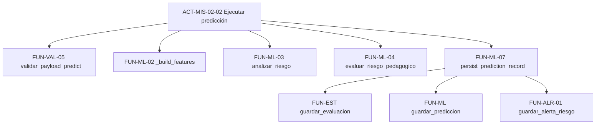

# Actividades y funciones — PredictEdu

Desglose de **actividades** (ACT-*) por procedimiento y catálogo de **funciones técnicas** (FUN-*) del código fuente.

---

## 1. Catálogo de actividades

### PROC-SOP-01 — Acceso y sesión

| ID | Actividad | Rol | Descripción | Resultado esperado |
|----|-----------|-----|-------------|-------------------|
| ACT-SOP-01-01 | Iniciar sesión | Usuario | Ingresar credenciales en `LoginScreen` | Token + redirección a panel según rol |
| ACT-SOP-01-02 | Validar sesión al arranque | Sistema | `App.jsx` llama `/api/auth/me` | Sesión restaurada o login |
| ACT-SOP-01-03 | Cerrar sesión | Usuario | Botón Cerrar sesión | `localStorage` limpio; vuelta a login |

### PROC-MIS-01 — Matrícula

| ID | Actividad | Rol | Descripción | Resultado esperado |
|----|-----------|-----|-------------|-------------------|
| ACT-MIS-01-01 | Registrar alumno | Docente | Formulario DNI, nombre, sección | HTTP 201; alumno en BD |
| ACT-MIS-01-02 | Registrar apoderado | Docente | Datos contacto familiar opcionales | Apoderado principal vinculado |
| ACT-MIS-01-03 | Buscar por DNI | Docente | Campo DNI en Resumen | Alumno cargado en formulario análisis |
| ACT-MIS-01-04 | Listar y filtrar alumnos | Docente | Tabla Estudiantes con filtros | Lista paginada por tutor/sección |

### PROC-MIS-02 — Evaluación y predicción

| ID | Actividad | Rol | Descripción | Resultado esperado |
|----|-----------|-----|-------------|-------------------|
| ACT-MIS-02-01 | Ingresar evaluación | Docente | Bimestre, asistencia, notas, participación | Formulario válido listo para enviar |
| ACT-MIS-02-02 | Ejecutar predicción | Docente / Sistema | `POST /api/predict` | Etiqueta riesgo + factores + persistencia |
| ACT-MIS-02-03 | Guardar competencias | Docente | Chips opcionales por área curricular | Filas en `competencias_notas` |
| ACT-MIS-02-04 | Registrar asistencia diaria | Docente / API | Estado por fecha | `asistencias_diarias`; recálculo % |

### PROC-MIS-03 — Alertas e intervención

| ID | Actividad | Rol | Descripción | Resultado esperado |
|----|-----------|-----|-------------|-------------------|
| ACT-MIS-03-01 | Generar alerta | Sistema | Tras predicción de riesgo medio/alto | Fila en `alertas_riesgo` |
| ACT-MIS-03-02 | Ver alertas prioritarias | Docente | Pestaña Alertas / resumen | Lista ordenada por prioridad |
| ACT-MIS-03-03 | Cambiar estado alerta | Docente | PATCH estado | Transición válida en BD |
| ACT-MIS-03-04 | Registrar seguimiento | Docente | Acción + detalle en bitácora | Fila `seguimiento_alertas` |
| ACT-MIS-03-05 | Crear intervención | Docente | Tipo, título, fecha | Fila `intervenciones` |
| ACT-MIS-03-06 | Cerrar intervención | Docente | Cambio estado a cerrada | `fecha_cierre` registrada |

### PROC-MIS-04 — Reforzamiento

| ID | Actividad | Rol | Descripción | Resultado esperado |
|----|-----------|-----|-------------|-------------------|
| ACT-MIS-04-01 | Listar talleres | Docente | Pestaña Reforzamiento | Cursos del año activo |
| ACT-MIS-04-02 | Inscribir alumno | Docente | Desde alerta o curso | Inscripción única por curso |
| ACT-MIS-04-03 | Registrar sesión | Docente | Fecha, tema, modalidad | Sesión en historial del curso |
| ACT-MIS-04-04 | Subir material | Docente | PDF/DOC/MP4 o enlace | Archivo en `uploads/` + metadato BD |

### PROC-MIS-05 — Convivencia

| ID | Actividad | Rol | Descripción | Resultado esperado |
|----|-----------|-----|-------------|-------------------|
| ACT-MIS-05-01 | Registrar incidencia | Docente | Tipo, severidad, descripción | Incidencia asociada al alumno |
| ACT-MIS-05-02 | Crear derivación | Docente | Entidad externa, motivo | Derivación en seguimiento |
| ACT-MIS-05-03 | Ver ficha convivencia | Docente | Desde lista Estudiantes | Incidencias y derivaciones del alumno |

### PROC-EST-01 — Indicadores

| ID | Actividad | Rol | Descripción | Resultado esperado |
|----|-----------|-----|-------------|-------------------|
| ACT-EST-01-01 | Consultar indicadores | Admin / Docente | Selector año/mes | Tabla KPI por sección |
| ACT-EST-01-02 | Calcular indicadores | Admin / Docente | Botón calcular | Upsert en `indicadores_mensuales` |

### PROC-EST-02 — Reportes

| ID | Actividad | Rol | Descripción | Resultado esperado |
|----|-----------|-----|-------------|-------------------|
| ACT-EST-02-01 | Exportar reporte | Docente | Botón Excel | Archivo `.xlsx` guardado |
| ACT-EST-02-02 | Ver dashboard | Docente | Pestaña Resumen | Tarjetas alto/medio/bajo |

### PROC-SOP-02 — SIAGIE

| ID | Actividad | Rol | Descripción | Resultado esperado |
|----|-----------|-----|-------------|-------------------|
| ACT-SOP-02-01 | Cargar Excel | Admin / Docente | Upload archivo | Resumen filas OK/error |
| ACT-SOP-02-02 | Auditar cargas | Admin | Historial SIAGIE | Lista `cargas_siagie` |

### PROC-SOP-03 — Mantenimiento

| ID | Actividad | Rol | Descripción | Resultado esperado |
|----|-----------|-----|-------------|-------------------|
| ACT-SOP-03-01 | Ver estado sistema | Admin | Panel / status | `model_loaded`, BD ready |
| ACT-SOP-03-02 | Activar año escolar | Admin | Selector año | Un solo año `activo=1` |
| ACT-SOP-03-03 | Limpiar datos demo | Admin | Botón eliminar demo | Alumnos inválidos borrados |
| ACT-SOP-03-04 | Limpiar inválidos al login | Sistema | DELETE automático docente | Padrón sin DNI basura |

### PROC-SOP-04 — Administración

| ID | Actividad | Rol | Descripción | Resultado esperado |
|----|-----------|-----|-------------|-------------------|
| ACT-SOP-04-01 | Gestionar usuarios | Admin | Tabla usuarios | Listado `usuarios_sistema` |
| ACT-SOP-04-02 | Ver docentes y secciones | Admin | Tabs docentes/secciones | Estructura institucional |

---

## 2. Catálogo de funciones técnicas (FUN-*)

### 2.1 Autenticación y seguridad

| ID | Función | Archivo | Tipo | Invocada por |
|----|---------|---------|------|--------------|
| FUN-AUTH-01 | `create_access_token` | `auth_tokens.py` | SVC | `api_login` |
| FUN-AUTH-02 | `decode_access_token` | `auth_tokens.py` | SVC | `get_current_user` |
| FUN-AUTH-03 | `get_current_user` | `auth_guard.py` | SVC | Middleware, controladores |
| FUN-AUTH-04 | `autenticar_usuario` | `repository.py` | MDL | `api_login` |
| FUN-AUTH-05 | `authFetch` / `authFetchJson` | `apiClient.js` | FE | Toda la UI autenticada |
| FUN-AUTH-06 | `register_security_headers` | `security_headers.py` | SVC | Arranque Flask |

### 2.2 Validación

| ID | Función | Archivo | Tipo | Uso |
|----|---------|---------|------|-----|
| FUN-VAL-01 | `normalizar_dni` | `validators.py` | SVC | Registro, búsqueda |
| FUN-VAL-02 | `validar_nota_literal` | `validators.py` | SVC | Predict, evaluaciones |
| FUN-VAL-03 | `validar_asistencias` | `validators.py` | SVC | Predict |
| FUN-VAL-04 | `validateDni` / `validateBusquedaEstudiante` | `validators.js` | FE | Formularios cliente |
| FUN-VAL-05 | `_validar_payload_predict` | `app.py` | CTL | `api_predict` |

### 2.3 Predicción e inteligencia artificial

| ID | Función | Archivo | Tipo | Uso |
|----|---------|---------|------|-----|
| FUN-ML-01 | `_load_model` | `app.py` | CTL | Carga `modelo_rf.pkl` |
| FUN-ML-02 | `_build_features` | `app.py` | CTL | Vector para Random Forest |
| FUN-ML-03 | `_analizar_riesgo` | `app.py` | CTL | ML + pedagógico |
| FUN-ML-04 | `evaluar_riesgo_pedagogico` | `risk_engine.py` | SVC | Factores explicativos |
| FUN-ML-05 | `nivel_riesgo_desde_probabilidad` | `risk_engine.py` | SVC | Clasificación alto/medio/bajo |
| FUN-ML-06 | `nota_a_puntaje` | `risk_engine.py` | SVC | AD/A/B/C → 1–4 |
| FUN-ML-07 | `_persist_prediction_record` | `app.py` | CTL | Evaluación + predicción + alerta |
| FUN-ML-08 | `train_model.py` | `ml_models/` | Offline | Genera `.pkl` |

### 2.4 Estudiantes y matrícula

| ID | Función | Archivo | Tipo | Uso |
|----|---------|---------|------|-----|
| FUN-EST-01 | `registrar_estudiante` | `repository.py` | MDL | Alta alumno |
| FUN-EST-02 | `matricular_estudiante` | `repository.py` | MDL | Asignar sección |
| FUN-EST-03 | `buscar_estudiante_por_dni` | `repository.py` | MDL | Búsqueda |
| FUN-EST-04 | `listar_estudiantes_detallado` | `repository.py` | MDL | Listado con joins |
| FUN-EST-05 | `guardar_apoderado_principal` | `repository.py` | MDL | Contacto familiar |
| FUN-EST-06 | `handleRegisterStudent` | `DocenteApp.jsx` | FE | Orquestación registro UI |

### 2.5 Alertas e intervenciones

| ID | Función | Archivo | Tipo | Uso |
|----|---------|---------|------|-----|
| FUN-ALR-01 | `guardar_alerta_riesgo` | `repository.py` | MDL | Crear alerta |
| FUN-ALR-02 | `actualizar_estado_alerta` | `repository.py` | MDL | Ciclo de vida |
| FUN-ALR-03 | `registrar_seguimiento_alerta` | `repository.py` | MDL | Bitácora |
| FUN-ALR-04 | `obtener_alertas_prioritarias` | `repository.py` | MDL | Dashboard |
| FUN-INT-01 | `registrar_intervencion` | `repository.py` | MDL | Nueva intervención |
| FUN-INT-02 | `listar_intervenciones` | `repository.py` | MDL | Historial filtrado |

### 2.6 Reforzamiento y convivencia

| ID | Función | Archivo | Tipo | Uso |
|----|---------|---------|------|-----|
| FUN-REF-01 | `inscribir_estudiante_reforzamiento` | `reforzamiento.py` | MDL | Inscripción taller |
| FUN-REF-02 | `crear_material_reforzamiento` | `reforzamiento.py` | MDL | Biblioteca curso |
| FUN-REF-03 | `inferir_motivo_inscripcion` | `reforzamiento.py` | MDL | Desde nivel riesgo |
| FUN-CON-01 | `crear_incidencia_convivencia` | `convivencia.py` | MDL | Incidencia |
| FUN-CON-02 | `crear_derivacion_externa` | `convivencia.py` | MDL | Derivación UGEL, etc. |

### 2.7 Indicadores y reportes

| ID | Función | Archivo | Tipo | Uso |
|----|---------|---------|------|-----|
| FUN-IND-01 | `calcular_indicadores_mensuales` | `indicadores.py` | MDL | Agregación mensual |
| FUN-IND-02 | `listar_indicadores` | `indicadores.py` | MDL | Consulta KPI |
| FUN-RPT-01 | `_build_reporte_dataframe` | `app.py` | CTL | Excel estudiantes |
| FUN-RPT-02 | `downloadBlob` | `downloadFile.js` | FE | Guardar archivo Tauri/web |
| FUN-RPT-03 | `save_download` | `src-tauri/lib.rs` | Nativo | Diálogo Guardar como |

### 2.8 SIAGIE y administración

| ID | Función | Archivo | Tipo | Uso |
|----|---------|---------|------|-----|
| FUN-SIA-01 | `api_upload_siagie` | `app.py` | CTL | Importación masiva |
| FUN-SIA-02 | `registrar_carga_siagie` | `repository.py` | MDL | Auditoría carga |
| FUN-SIA-03 | `_normalize_column_name` | `app.py` | CTL | Mapeo columnas Excel |
| FUN-ADM-01 | `activar_anio_escolar` | `repository.py` | MDL | Año vigente |
| FUN-ADM-02 | `eliminar_estudiantes_demo` | `repository.py` | MDL | Limpieza padrón |
| FUN-ADM-03 | `get_database_status` | `repository.py` | MDL | `/api/status` |

### 2.9 Base de datos

| ID | Función | Archivo | Tipo | Uso |
|----|---------|---------|------|-----|
| FUN-DB-01 | `setup_database` / `init_database` | `db_setup.py` / `repository.py` | MDL | Crear/actualizar esquema |
| FUN-DB-02 | `get_connection` | `repository.py` | MDL | Context manager SQLite |
| FUN-DB-03 | `_create_tables` | `db_setup.py` | MDL | DDL 24 tablas |

---

## 3. Mapa actividad → función (ejemplos críticos)

| Actividad | Cadena de funciones principales |
|-----------|--------------------------------|
| ACT-MIS-01-01 | `handleRegisterStudent` → `validateDni` → `api_registrar_estudiante` → `registrar_estudiante` → `matricular_estudiante` |
| ACT-MIS-02-02 | `handleSubmit` → `api_predict` → `_analizar_riesgo` → `_persist_prediction_record` |
| ACT-SOP-02-01 | `handleUploadSiagie` → `api_upload_siagie` → `buscar_o_crear_estudiante` → `api_predict` (por fila) |
| ACT-EST-01-02 | `onCalcular` → `api_indicadores_calcular` → `calcular_indicadores_mensuales` |

---

## 4. Otros artefactos de código

| Artefacto | Ubicación | Relación con procesos |
|-----------|-----------|----------------------|
| Suite pytest (82 tests) | `tests/` | Verificación PROC-MIS-02, SOP-01, SOP-02 |
| Matriz RF↔CP | `tests/matriz-trazabilidad.md` | Trazabilidad requisitos |
| Entrenamiento ML | `ml_models/train_model.py` | Soporte a PROC-MIS-02 (offline) |
| SonarQube | `sonar-project.properties` | Calidad MP-SOP (PROC-SOP-03) |
| Docker Compose Sonar | `docker-compose.yml` | Infraestructura calidad |

---

*Total documentado: **32 actividades**, **50+ funciones** técnicas nombradas. Ampliar al agregar nuevos PROC/ACT en [matriz-doble-entrada.md](./matriz-doble-entrada.md).*
