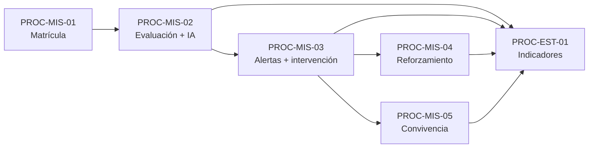

# Procedimientos — PredictEdu

Catálogo de **procedimientos** (PROC-*) desglosados por macroproceso. Cada procedimiento agrupa actividades homogéneas ejecutadas por roles definidos.

**Convención:** `PROC-{MP}-{nn}` donde MP = EST | MIS | SOP.

---

## MP-EST — Estratégico

### PROC-EST-01 — Gestión de indicadores institucionales

| Campo | Detalle |
|-------|---------|
| **Objetivo** | Medir mensualmente asistencia, distribución de riesgo, intervenciones y derivaciones |
| **Responsable** | Dirección / administrador |
| **Frecuencia** | Mensual (o bajo demanda) |
| **Entrada** | Año y mes calendario; datos acumulados en BD |
| **Salida** | Registros en `indicadores_mensuales`; vista en pestaña Indicadores |
| **Actividades** | ACT-EST-01-01, ACT-EST-01-02 |
| **API** | `GET /api/indicadores`, `POST /api/indicadores/calcular` |
| **Código** | `database/indicadores.py`, `IndicadoresPanel.jsx` |

**Pasos:**

1. Seleccionar año y mes en la UI.
2. Consultar indicadores existentes (`listar_indicadores`).
3. Opcionalmente ejecutar recálculo (`calcular_indicadores_mensuales`).
4. Revisar por sección o total institucional (solo admin ve institución completa).

---

### PROC-EST-02 — Reportes y tablero de decisión

| Campo | Detalle |
|-------|---------|
| **Objetivo** | Disponer resumen ejecutivo y exportación para UGEL o dirección |
| **Responsable** | Admin, docente (alcance de sus secciones) |
| **Entrada** | Filtros de estudiantes (búsqueda, riesgo, sección) |
| **Salida** | Dashboard numérico; archivo `.xlsx` |
| **Actividades** | ACT-EST-02-01, ACT-EST-02-02 |
| **API** | `GET /api/resumen`, `GET /api/reportes/exportar` |

**Pasos:**

1. Cargar resumen al abrir panel (`obtener_resumen_dashboard`).
2. Aplicar filtros en listado de estudiantes.
3. Exportar reporte Excel con hojas Estudiantes e Indicadores.
4. Guardar archivo (diálogo nativo en Tauri o descarga navegador).

---

## MP-MIS — Misional

### PROC-MIS-01 — Admisión, matrícula y padrón

| Campo | Detalle |
|-------|---------|
| **Objetivo** | Incorporar alumnos al padrón con DNI, sección y contacto familiar |
| **Responsable** | Docente tutor |
| **Entrada** | Formulario registro; DNI único 8 dígitos |
| **Salida** | `estudiantes` + `matriculas` + opcional `apoderados` |
| **Actividades** | ACT-MIS-01-01 a ACT-MIS-01-04 |
| **API** | `POST /api/estudiantes`, `GET /api/estudiantes`, `GET .../buscar` |

**Reglas de negocio:**

- DNI único en `estudiantes`.
- Un alumno, una matrícula por año escolar activo.
- Docente solo matricula en secciones donde es tutor.
- Apoderado opcional; si se completa parcialmente, se validan todos los campos de contacto.

---

### PROC-MIS-02 — Evaluación pedagógica y predicción de riesgo

| Campo | Detalle |
|-------|---------|
| **Objetivo** | Registrar indicadores de aula y estimar riesgo de deserción |
| **Responsable** | Docente |
| **Entrada** | Asistencia %, notas literales (AD/A/B/C), participación 0–10, bimestre |
| **Salida** | Evaluación persistida; predicción ML; factores explicativos |
| **Actividades** | ACT-MIS-02-01 a ACT-MIS-02-04 |
| **API** | `POST /api/predict`, `POST /api/asistencias-diarias` |

**Pasos:**

1. Buscar alumno registrado por DNI.
2. Completar formulario de evaluación (`docenteForm.jsx`).
3. Enviar a `api_predict`: vector ML + `evaluar_riesgo_pedagogico`.
4. Persistir evaluación, predicción y alerta si corresponde.
5. Mostrar resultado, nivel de riesgo y mensaje motivacional en UI.

---

### PROC-MIS-03 — Alerta temprana, seguimiento e intervención

| Campo | Detalle |
|-------|---------|
| **Objetivo** | Priorizar alumnos en riesgo y documentar acciones de acompañamiento |
| **Responsable** | Docente tutor |
| **Entrada** | Alertas generadas por predicción o umbral pedagógico |
| **Salida** | Estados de alerta; bitácora; intervenciones |
| **Actividades** | ACT-MIS-03-01 a ACT-MIS-03-06 |
| **API** | `PATCH /api/alertas/:id`, `POST .../seguimiento`, `POST/PATCH /api/intervenciones` |

**Ciclo de vida alerta:** `nueva` → `en_revision` → `atendida` → `cerrada`.

**Acciones desde alerta:** re-analizar, registrar intervención, copiar teléfono apoderado, inscribir en taller.

---

### PROC-MIS-04 — Reforzamiento académico

| Campo | Detalle |
|-------|---------|
| **Objetivo** | Ofrecer talleres de recuperación vinculados al perfil de riesgo |
| **Responsable** | Docente |
| **Entrada** | Curso activo; alumno con motivo (riesgo, bajo rendimiento, etc.) |
| **Salida** | Inscripción, sesiones, materiales, resultado |
| **Actividades** | ACT-MIS-04-01 a ACT-MIS-04-04 |
| **API** | Rutas `/api/cursos-reforzamiento/*`, `/api/inscripciones/:id` |

---

### PROC-MIS-05 — Convivencia escolar y derivación

| Campo | Detalle |
|-------|---------|
| **Objetivo** | Registrar incidentes y derivar a entidades externas cuando corresponda |
| **Responsable** | Docente |
| **Entrada** | Tipo incidencia, severidad, descripción; entidad destino (UGEL, DEMUNA, etc.) |
| **Salida** | `incidencias_convivencia`, `derivaciones_externas` |
| **Actividades** | ACT-MIS-05-01 a ACT-MIS-05-03 |
| **API** | `/api/incidencias`, `/api/derivaciones` |

---

## MP-SOP — Soporte

### PROC-SOP-01 — Control de acceso y sesión

| Campo | Detalle |
|-------|---------|
| **Objetivo** | Autenticar personal del colegio y separar experiencias admin/docente |
| **Responsable** | Sistema |
| **Entrada** | Usuario y contraseña |
| **Salida** | Token JWT 12 h; objeto `user` en localStorage |
| **Actividades** | ACT-SOP-01-01 a ACT-SOP-01-03 |
| **API** | `POST /api/auth/login`, `GET /api/auth/me` |

**Roles:** `admin` → `AdminApp`; `docente` → `DocenteApp`.

---

### PROC-SOP-02 — Integración SIAGIE (carga masiva)

| Campo | Detalle |
|-------|---------|
| **Objetivo** | Importar padrón y notas desde Excel institucional |
| **Responsable** | Admin o docente autorizado |
| **Entrada** | Archivo `.xlsx` con columnas normalizadas |
| **Salida** | Estudiantes/evaluaciones; registro en `cargas_siagie`; predicciones por fila |
| **Actividades** | ACT-SOP-02-01, ACT-SOP-02-02 |
| **API** | `POST /api/upload_siagie`, `GET /api/admin/cargas-siagie` |

---

### PROC-SOP-03 — Mantenimiento de plataforma y datos

| Campo | Detalle |
|-------|---------|
| **Objetivo** | Garantizar BD consistente, año escolar vigente y diagnóstico del sistema |
| **Responsable** | Administrador |
| **Entrada** | Comandos desde panel Mantenimiento |
| **Salida** | Año activo; limpieza demo; estado en `/api/status` |
| **Actividades** | ACT-SOP-03-01 a ACT-SOP-03-04 |
| **API** | `/api/status`, `/api/admin/anio-escolar`, deletes demo/inválidos |

---

### PROC-SOP-04 — Administración de personal y estructura

| Campo | Detalle |
|-------|---------|
| **Objetivo** | Consultar docentes, usuarios, secciones y cargas históricas |
| **Responsable** | Administrador |
| **Entrada** | Panel admin |
| **Salida** | Listados de solo lectura (gestión CRUD completa en fases futuras) |
| **Actividades** | ACT-SOP-04-01, ACT-SOP-04-02 |
| **API** | `/api/admin/usuarios`, `docentes`, `secciones` |

---

## Diagrama de procedimientos misionales

---

## Índice rápido

| ID | Nombre | MP |
|----|--------|-----|
| PROC-EST-01 | Gestión de indicadores | Estratégico |
| PROC-EST-02 | Reportes y tablero | Estratégico |
| PROC-MIS-01 | Admisión y matrícula | Misional |
| PROC-MIS-02 | Evaluación y predicción | Misional |
| PROC-MIS-03 | Alertas e intervención | Misional |
| PROC-MIS-04 | Reforzamiento | Misional |
| PROC-MIS-05 | Convivencia | Misional |
| PROC-SOP-01 | Acceso y sesión | Soporte |
| PROC-SOP-02 | Carga SIAGIE | Soporte |
| PROC-SOP-03 | Mantenimiento | Soporte |
| PROC-SOP-04 | Admin personal | Soporte |

Detalle de actividades y funciones: [actividades-funciones.md](./actividades-funciones.md).
