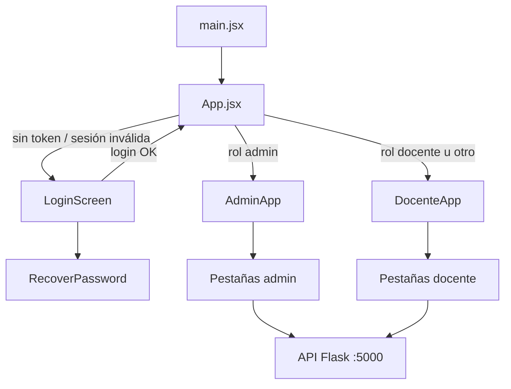
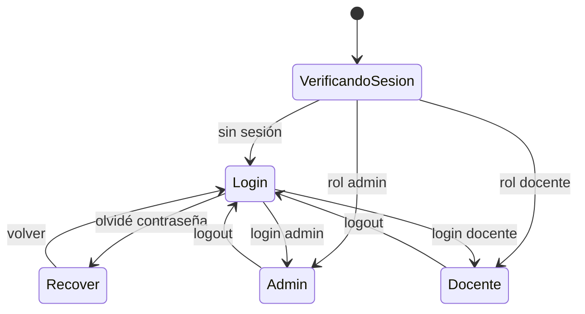
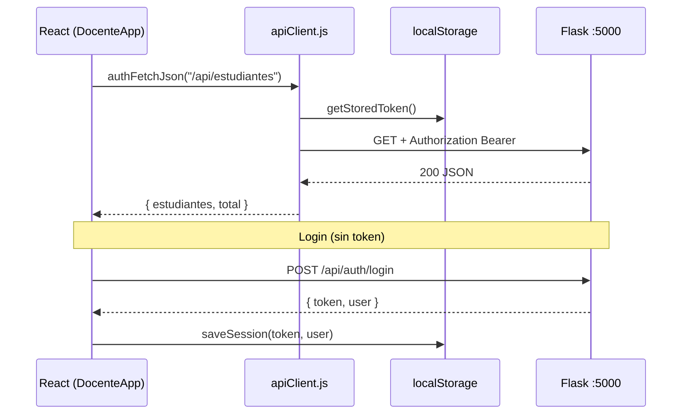

# Arquitectura del frontend — PredictEdu

## 1. Visión general

El frontend es una **SPA (Single Page Application)** en React, empaquetada con **Vite** y opcionalmente distribuida como aplicación de escritorio con **Tauri 2**. No usa React Router: la navegación se resuelve en tres niveles:

1. **Autenticación** — login vs. aplicación autenticada (`App.jsx`).
2. **Rol** — panel de docente (`DocenteApp`) o panel de administrador (`AdminApp`).
3. **Pestañas internas** — estado `activeTab` dentro de cada panel.



---

## 2. Estructura del proyecto

```
PredictHuacalle-main/
├── index.html              # Punto de entrada HTML (monta #root)
├── vite.config.js          # Vite + React + Tailwind; puerto 1420 (Tauri)
├── package.json
├── src/
│   ├── main.jsx            # ReactDOM.createRoot → <App />
│   ├── App.jsx             # Guardia de sesión y enrutamiento por rol
│   ├── apiClient.js        # Cliente HTTP, JWT y sesión en localStorage
│   ├── validators.js       # Validaciones de formulario (DNI, teléfono, etc.)
│   ├── downloadFile.js     # Descarga de blobs (navegador / Tauri)
│   ├── index.css           # Estilos globales + Tailwind
│   ├── App.css             # Estilos auxiliares
│   │
│   ├── LoginScreen.jsx     # Pantalla de inicio de sesión
│   ├── RecoverPassword.jsx # Recuperación de contraseña
│   │
│   ├── DocenteApp.jsx      # Panel principal del docente (~3 800 líneas)
│   ├── AdminApp.jsx        # Panel del administrador
│   │
│   ├── docenteForm.jsx     # Componentes reutilizables del formulario de análisis
│   ├── IndicadoresPanel.jsx# Vista compartida de indicadores mensuales
│   └── icons.jsx           # Iconos SVG inline
│
└── src-tauri/              # Shell de escritorio (Rust)
    └── src/lib.rs          # Comando save_download para exportar archivos
```

### 2.1 Responsabilidad por archivo

| Archivo | Responsabilidad |
|---------|-----------------|
| `main.jsx` | Montaje de React en modo estricto |
| `App.jsx` | Verificar sesión (`/api/auth/me`), elegir login o panel según `user.rol` |
| `LoginScreen.jsx` | Formulario de login, validación, llamada a `/api/auth/login` |
| `RecoverPassword.jsx` | Flujo de recuperación vía `/api/auth/recover` |
| `DocenteApp.jsx` | Toda la experiencia docente: resumen, alertas, estudiantes, intervenciones, reforzamiento, convivencia, indicadores |
| `AdminApp.jsx` | Gestión institucional: docentes, secciones, usuarios, SIAGIE, mantenimiento BD |
| `docenteForm.jsx` | UI del análisis de riesgo (sliders, chips de notas, campos de texto) |
| `IndicadoresPanel.jsx` | Tabla y controles de indicadores (reutilizado en docente y admin) |
| `apiClient.js` | Capa única de comunicación autenticada con el backend |
| `validators.js` | Reglas de validación compartidas entre pantallas |
| `downloadFile.js` | Guardar reportes Excel y materiales en disco (Tauri o navegador) |
| `icons.jsx` | Iconografía consistente (logout, upload, gráficos, etc.) |

---

## 3. Componentes principales

### 3.1 Árbol de componentes (alto nivel)

```
App
├── LoginScreen
│   └── RecoverPassword
├── DocenteApp
│   ├── Tab (navegación interna)
│   ├── SummaryCard, PriorityAlertsList, … (inline)
│   ├── docenteForm → TextField, FormSection, BimestrePills, GradeChips, …
│   └── IndicadoresPanel
└── AdminApp
    ├── AdminTab
    ├── StatCard
    └── IndicadoresPanel
```

### 3.2 `DocenteApp` — pestañas y funciones

| Pestaña (`activeTab`) | Función principal |
|----------------------|-------------------|
| `resumen` | Buscar alumno por DNI, cargar evaluación, ejecutar predicción ML, ver resultado de riesgo |
| `alertas` | Listar alertas de riesgo alto/medio; analizar, registrar intervención, inscribir en taller |
| `estudiantes` | Registrar alumno, listar con filtros, exportar reporte Excel, ficha de convivencia |
| `intervenciones` | Historial y registro de seguimientos pedagógicos |
| `reforzamiento` | Cursos/talleres, inscripciones, sesiones, materiales |
| `convivencia` | Incidencias y derivaciones externas |
| `indicadores` | Indicadores mensuales del docente (sus secciones) |

Componentes locales definidos dentro de `DocenteApp.jsx` (no exportados):

- `Tab` — botón de pestaña con badge opcional.
- `SummaryCard` — tarjetas de conteo de riesgo en resumen.
- `PriorityAlertsList` — lista de alertas con acciones.
- Subcomponentes de reforzamiento y convivencia renderizados condicionalmente.

### 3.3 `AdminApp` — pestañas

| Pestaña (`activeTab`) | Función principal |
|----------------------|-------------------|
| `panel` | Dashboard institucional: totales, estado del sistema |
| `docentes` | Listado de personal docente |
| `secciones` | Secciones por año escolar y tutor |
| `usuarios` | Cuentas de acceso al sistema |
| `siagie` | Cargas masivas SIAGIE |
| `indicadores` | Indicadores institucionales y por sección |
| `mantenimiento` | Año escolar activo, limpieza de datos demo, resumen de tablas |

### 3.4 `docenteForm.jsx` — componentes exportados

| Componente | Uso |
|------------|-----|
| `FormHint` | Texto de ayuda bajo etiquetas |
| `FormSection` | Bloque numerado del formulario de análisis (pasos 1–4) |
| `StudentFoundCard` | Tarjeta cuando el DNI existe en el sistema |
| `BimestrePills` | Selector de bimestre (1–4) |
| `AsistenciaSlider` | Slider 0–100 % de asistencia |
| `ParticipacionSlider` | Slider 0–10 de participación |
| `GradeChips` | Chips AD / A / B / C para notas literales |
| `TextField` | Campo de texto con contador DNI (8 dígitos) |

### 3.5 `IndicadoresPanel`

Componente compartido entre docente y administrador. Recibe por props:

- `anio`, `mes` — periodo consultado.
- `indicadores` — lista desde `/api/indicadores`.
- `onCalcular` — dispara `POST /api/indicadores/calcular`.
- `esAdmin` — ajusta textos (vista institucional vs. solo mis secciones).

---

## 4. Manejo de rutas y navegación

### 4.1 No hay URLs de rutas

El proyecto **no utiliza React Router**. La URL del navegador no cambia al cambiar de pantalla. La navegación es **condicional por estado React**.

### 4.2 Nivel 1 — `App.jsx` (acceso y rol)

```jsx
// Pseudológica de App.jsx
if (!authReady) return <Cargando />;
if (!authUser) return <LoginScreen />;
if (authUser.rol === "admin") return <AdminApp />;
return <DocenteApp />;
```

| Condición | Pantalla |
|-----------|----------|
| Sin token o `/api/auth/me` falla | `LoginScreen` |
| `user.rol === "admin"` | `AdminApp` |
| Cualquier otro rol autenticado | `DocenteApp` |

Al iniciar la app, si existe token en `localStorage`, se valida contra `GET /api/auth/me` antes de mostrar el panel.

### 4.3 Nivel 2 — Pestañas internas

**Docente** (`useState("resumen")`):

```
resumen | alertas | estudiantes | intervenciones | reforzamiento | convivencia | indicadores
```

**Admin** (`useState("panel")`):

```
panel | docentes | secciones | usuarios | siagie | indicadores | mantenimiento
```

Cada pestaña monta su sección con `{activeTab === "nombre" && ( ... )}`.

### 4.4 Nivel 3 — Vistas modales / flujos cruzados

Algunas acciones **cambian de pestaña** programáticamente:

| Acción | Destino |
|--------|---------|
| Registrar intervención desde alerta | `intervenciones` |
| Inscribir en taller desde alerta | `reforzamiento` |
| Registrar incidencia desde ficha | `convivencia` |
| Analizar alumno desde lista | `resumen` (con scroll al formulario) |

### 4.5 Login y recuperación

`LoginScreen` alterna vistas con `view === "login" | "recover"` sin cambiar la URL.



---

## 5. Comunicación con el backend

### 5.1 Configuración base

```javascript
// src/apiClient.js
export const API_BASE = "http://127.0.0.1:5000";
```

El frontend asume que el **sidecar Flask** está escuchando en el puerto **5000** del mismo equipo. En desarrollo Tauri, Vite corre en **1420** y el backend en **5000** por separado.

### 5.2 Autenticación y sesión

| Clave `localStorage` | Contenido |
|---------------------|-----------|
| `predictedu_token` | JWT Bearer |
| `predictedu_user` | JSON del usuario (`id`, `username`, `rol`, `docente_id`, `secciones`, …) |

**Flujo de login:**

```
LoginScreen → POST /api/auth/login { username, password }
           → saveSession(token, user)
           → App recibe user y monta el panel
```

**Peticiones autenticadas:**

```javascript
authHeaders() → { Authorization: "Bearer <token>", ... }
authFetch(url, options)     // fetch + 401 → clearSession()
authFetchJson(url, options) // authFetch + parse JSON + throw si !ok
```

Rutas **públicas** (sin token): `POST /api/auth/login`, `POST /api/auth/recover`, `GET /api/status`.

### 5.3 Capas de llamada en la UI

| Capa | Función | Uso |
|------|---------|-----|
| `fetch` directo | Sin wrapper | Solo login y recuperación |
| `authFetch` | Respuesta cruda (`blob`, `FormData`) | Exportar Excel, subir SIAGIE, descargar materiales |
| `authFetchJson` | JSON parseado + errores | Mayoría de GET/POST/PATCH |
| `fetchJson` (local en DocenteApp) | Alias de `authFetchJson` | Escritura en panel docente |

### 5.4 Endpoints consumidos por pantalla

#### Autenticación (`App`, `LoginScreen`, `RecoverPassword`)

| Método | Endpoint | Descripción |
|--------|----------|-------------|
| POST | `/api/auth/login` | Inicio de sesión |
| GET | `/api/auth/me` | Validar token al arrancar |
| POST | `/api/auth/recover` | Recuperar contraseña |

#### Panel docente (`DocenteApp`)

| Método | Endpoint | Descripción |
|--------|----------|-------------|
| GET | `/api/resumen` | Dashboard: totales, alertas, última predicción |
| GET | `/api/secciones` | Secciones del docente |
| GET/POST | `/api/estudiantes` | Listar / registrar alumnos |
| GET | `/api/estudiantes/buscar?dni=` | Buscar por DNI |
| DELETE | `/api/estudiantes/invalidos` | Limpiar registros demo al iniciar |
| POST | `/api/estudiantes/:id/apoderado` | Guardar contacto familiar |
| POST | `/api/predict` | Ejecutar predicción ML |
| GET | `/api/alertas`, `/api/alertas/:id/historial` | Alertas de riesgo |
| PATCH | `/api/alertas/:id` | Cambiar estado de alerta |
| GET/POST | `/api/intervenciones` | Listar / crear intervenciones |
| PATCH | `/api/intervenciones/:id` | Cerrar intervención |
| GET | `/api/cursos-reforzamiento`, `/:id` | Talleres de reforzamiento |
| POST | `/api/cursos-reforzamiento/:id/inscripciones` | Inscribir alumno |
| POST | `/api/cursos-reforzamiento/:id/sesiones` | Registrar sesión |
| POST | `/api/cursos-reforzamiento/:id/materiales` | Subir material |
| GET | `/api/materiales-reforzamiento/:id/descargar` | Descargar archivo |
| PATCH | `/api/inscripciones/:id` | Actualizar resultado |
| GET/POST | `/api/incidencias` | Convivencia escolar |
| GET/POST/PATCH | `/api/derivaciones` | Derivaciones externas |
| GET | `/api/indicadores` | Indicadores mensuales |
| POST | `/api/indicadores/calcular` | Recalcular indicadores |
| GET | `/api/reportes/exportar` | Exportar Excel/CSV |
| POST | `/api/upload_siagie` | Carga masiva SIAGIE |

#### Panel admin (`AdminApp`)

| Método | Endpoint | Descripción |
|--------|----------|-------------|
| GET | `/api/admin/cargas-siagie` | Historial de cargas |
| GET | `/api/admin/usuarios` | Usuarios del sistema |
| GET | `/api/admin/docentes` | Personal docente |
| GET | `/api/admin/secciones` | Todas las secciones |
| GET | `/api/admin/resumen-bd` | Conteo de tablas |
| GET/POST | `/api/admin/anio-escolar` | Años escolares |
| DELETE | `/api/admin/estudiantes/demo` | Eliminar datos de prueba |
| GET | `/api/resumen`, `/api/status` | Estado general |
| POST | `/api/upload_siagie` | Carga SIAGIE |
| GET/POST | `/api/indicadores`, `/calcular` | Indicadores institucionales |

### 5.5 Manejo de errores

- **401** — `authFetch` limpia sesión y lanza *"Sesión expirada…"*; `App` vuelve al login.
- **4xx/5xx** — `authFetchJson` lanza `Error` con `data.error` del backend.
- **UI** — `DocenteApp` y `AdminApp` muestran banner rojo global (`error`) y mensajes locales por formulario (`registerError`, `searchMessage`, etc.).

### 5.6 Carga de archivos y descargas

| Operación | Mecanismo |
|-----------|-----------|
| Subir SIAGIE | `FormData` + `authFetch` → `POST /api/upload_siagie` |
| Subir material taller | `FormData` multipart al curso |
| Exportar reporte | `authFetch` → `blob` → `downloadFile.js` |
| Descargar material | Igual; en Tauri invoca `save_download` (Rust + diálogo nativo) |

### 5.7 Diagrama de comunicación



---

## 6. Estado y efectos

### 6.1 Estado global de la sesión

Solo en `App.jsx`: `authUser`, `authReady`. El resto del estado es **local por panel**.

### 6.2 Patrones en `DocenteApp`

| Patrón | Ejemplo |
|--------|---------|
| `useState` | Formularios, listas, filtros, pestaña activa |
| `useCallback` | `loadStudents`, `loadSecciones`, `refreshDashboard` |
| `useEffect` | Cargar datos al cambiar `activeTab` o filtros |
| `useMemo` | Etiquetas de sección, validación de formulario |
| `useRef` | Evitar doble envío de predicción; scroll al análisis |

### 6.3 Carga inicial del docente

Al montar `DocenteApp`:

1. `loadSecciones()` — secciones asignadas.
2. `DELETE /api/estudiantes/invalidos` — limpieza silenciosa de demos.
3. `refreshDashboard()` — resumen + intervenciones + estudiantes.

---

## 7. Estilos y UX

- **Tailwind CSS 4** vía plugin `@tailwindcss/vite`.
- Tema oscuro: fondos `zinc-950/900`, acentos `emerald` (acciones), `blue` (búsqueda), `red/amber` (alertas).
- Diseño responsive con breakpoints `sm`, `md`, `lg`.
- Referencia de diseño en Figma documentada en `documentacion/diseno-figma.md`.

---

## 8. Empaquetado Tauri

| Elemento | Detalle |
|----------|---------|
| Dev | `npm run tauri dev` → Vite :1420 + WebView |
| Build frontend | `npm run build` → `dist/` |
| Comando Rust | `save_download` — diálogo "Guardar como" en Windows |
| Detección | `downloadFile.js` comprueba `window.__TAURI_INTERNALS__` |

El frontend **no conoce SQLite** directamente; toda persistencia pasa por la API REST del sidecar Flask.

---

## 9. Validaciones en cliente

`validators.js` centraliza reglas usadas en login, registro, búsqueda y formularios:

| Función | Regla |
|---------|-------|
| `validateDni` | 8 dígitos numéricos |
| `validateNombre` | 3–120 caracteres |
| `validateTelefono` | 9 dígitos, empieza con 9 |
| `validateBusquedaEstudiante` | Si solo números → DNI completo; si hay letras → búsqueda por nombre |
| `validateSeccionRequerida` | Obligatoria si el docente tiene secciones |
| `sanitizeDniInput` / `sanitizeTelefonoInput` | Limpieza en tiempo real |

---

*Documento alineado con el código en `src/` y `vite.config.js`.*
