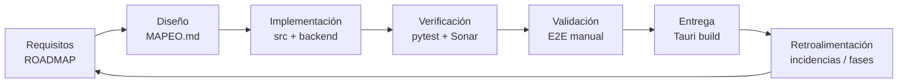

# Sistema de Gestión de Calidad — ISO 9001

**Producto:** PredictEdu — predicción de riesgo de deserción escolar  
**Alcance del SGC:** diseño, desarrollo, prueba y mantenimiento del software de escritorio (Tauri + React) y motor local (Flask + SQLite).

---

## 1. Política de calidad

La institución y el equipo de desarrollo se comprometen a:

1. Entregar un software **útil para la acción docente** (alertas, intervenciones, indicadores), no solo predicción.
2. Basar decisiones en **requisitos trazables** (`docs/ROADMAP-FASES.md`, matriz RF↔CP).
3. Validar cambios con **pruebas automatizadas** y revisión de calidad (SonarQube).
4. Proteger **datos sensibles de alumnos** conforme a la política de seguridad (ISO 27001).
5. Mejorar de forma continua mediante retrospectivas por fase y métricas de CI.

---

## 2. Contexto y partes interesadas

| Parte interesada | Necesidad | Respuesta del sistema |
|------------------|-----------|------------------------|
| Docentes / tutores | Identificar alumnos en riesgo | Análisis, alertas, ficha alumno |
| Administración | Operación del colegio | Panel admin, SIAGIE, año escolar |
| Familias (indirecto) | Contacto oportuno | Datos de apoderado, mensajes |
| UGEL / convivencia | Derivaciones e indicadores | Módulos convivencia e indicadores |
| Equipo técnico | Mantenibilidad | Arquitectura documentada (`MAPEO.md`) |

---

## 3. Procesos del ciclo de vida (mapa)

### 3.1 Desarrollo de requisitos

- Fuente: `docs/ROADMAP-FASES.md`, fases 1–14.
- Criterios de aceptación por fase con casillas verificables.

### 3.2 Diseño e implementación

- Separación cliente (`src/`) / API (`backend-sidecar/`).
- Convenciones: validadores compartidos, repositorio SQLite, roles JWT.

### 3.3 Verificación y validación

- **Verificación:** pruebas automatizadas (`tests/`), cobertura, análisis estático.
- **Validación:** pruebas con usuario piloto (docente), registro en `tests/registro-de-ejecucion.md`.

### 3.4 Liberación

- Script `start_dev.bat` / build Tauri.
- Checklist: modelo `.pkl`, BD inicializada, credenciales demo documentadas.

### 3.5 Mejora continua

- CI en cada push/PR (`.github/workflows/ci.yml`).
- Informes SonarQube (`docs/sonarqube-capturas/`).
- Corrección de hallazgos y actualización de documentación ISO.

---

## 4. Gestión de riesgos (calidad del producto)

| Riesgo | Mitigación |
|--------|------------|
| Predicción incorrecta | Explicación de factores, no decisión automática de baja |
| Pérdida de datos | SQLite local + respaldo institucional recomendado |
| Acceso no autorizado | Autenticación JWT y roles (`auth_guard.py`) |
| Regresiones | Suite pytest + matriz de trazabilidad |

---

## 5. Indicadores de desempeño (KPI)

| KPI | Medición | Meta |
|-----|----------|------|
| Pruebas automatizadas en verde | CI / `pytest` | 100 % pass en main |
| Cobertura backend | `pytest-cov` | ≥ 70 % (objetivo institucional) |
| Hallazgos críticos Sonar | Dashboard SonarQube | 0 bloqueantes |
| Requisitos con CP asociado | `matriz-trazabilidad.md` | RF núcleo cubiertos |

---

## 6. Documentos del SGC

Ver [control-documental.md](./control-documental.md) y [README.md](./README.md).
