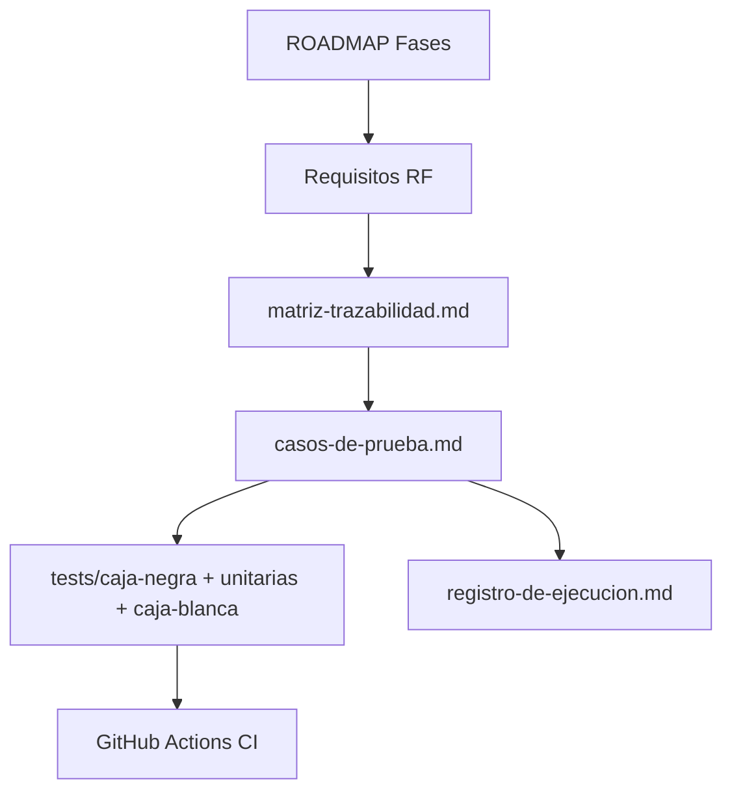

# Proceso de pruebas — ISO/IEC/IEEE 29119

**Política de pruebas PredictEdu** alineada con la serie 29119 (procesos, documentación, diseño y ejecución).

---

## 1. Política de pruebas (29119-1)

1. Todo cambio en `backend-sidecar/` que afecte API o reglas de negocio debe ejecutar `pytest` antes de integrar.
2. Los requisitos funcionales núcleo deben tener al menos un caso de prueba en `tests/caja-negra/casos-de-prueba.md`.
3. Los defectos se registran en el registro de ejecución o en el gestor de incidencias del proyecto.
4. No se despliega a usuarios piloto con fallos críticos (RF-02, RF-04, autenticación).

---

## 2. Estrategia de pruebas (29119-2)

| Nivel | Técnica | Herramienta | Ubicación |
|-------|---------|-------------|-----------|
| Unitario | Caja negra sobre API Flask | pytest | `tests/caja-negra/` |
| Integración | BD aislada + cliente de prueba | pytest + `isolated_db` | `tests/caja-blanca/`, `tests/conftest.py` |
| Unitario (módulos) | Validadores y reglas de negocio | pytest | `tests/unitarias/` |
| Sistema | E2E manual Tauri + Flask | Checklist CP | `tests/caja-negra/casos-de-prueba.md` |
| Regresión | Suite completa en CI | GitHub Actions | `.github/workflows/ci.yml` |

### Criterios de salida

- CI en verde.
- Casos **prioridad Alta** ejecutados en el entorno objetivo (Windows).
- Sin regresiones en autenticación, predicción y carga SIAGIE.

---

## 3. Plan de pruebas (29119-3)

Documento maestro: **[tests/plan-de-pruebas.md](../../tests/plan-de-pruebas.md)** (versión actualizada con referencia ISO).

Incluye: objetivo, alcance, entorno, criterios de entrada/salida, roles y riesgos.

---

## 4. Diseño de pruebas (29119-4)

| Documento | Contenido |
|-----------|-----------|
| `tests/caja-negra/casos-de-prueba.md` | CP-001 … CP-0xx con pasos y resultados esperados |
| `tests/matriz-trazabilidad.md` | RF ↔ CP |
| `tests/caja-negra/ejemplos-curl.md` | Scripts reproducibles para API |

### Convención de identificadores

- **RF-XX:** requisito funcional  
- **CP-XXX:** caso de prueba  
- **TC-XXX:** caso automatizado en pytest (nombre de función `test_*`)

---

## 5. Ejecución y reportes (29119-5)

| Actividad | Evidencia |
|-----------|-----------|
| Ejecución local | Salida `pytest -q` |
| CI | `pytest-report.xml` (JUnit) |
| Cobertura | `--cov=backend-sidecar` en CI |
| Ejecución manual | `tests/registro-de-ejecucion.md` |

---

## 6. Trazabilidad requisitos ↔ pruebas

---

## 7. Roles

| Rol | Responsabilidad |
|-----|-----------------|
| Desarrollador | Escribir y mantener tests automatizados |
| Tester / docente piloto | Ejecutar CP manuales y registrar resultados |
| Administrador de calidad | Revisar cobertura, SonarQube y esta política |
